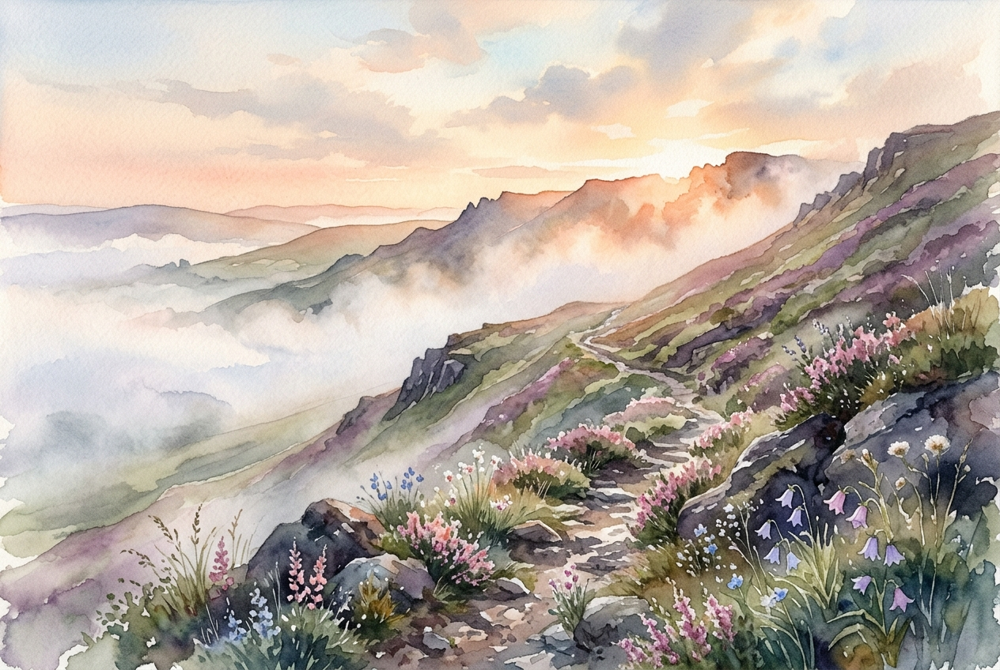

# Leitura Diária: Matthew 5:1-12

*18 de julho de 2026*

> *(Image: A gentle sunrise illuminating a rugged, mist-covered hillside with wildflowers growing quietly among the rocks.)*

## A Leitura (PT-NVI)

**Matthew 5:1-12**

> 1 Vendo as multidões, Jesus subiu ao monte e se assentou. Seus discípulos aproximaram-se dele, 2 e ele começou a ensiná-los, dizendo: 3 "Bem-aventurados os pobres em espírito, pois deles é o Reino dos céus. 4 Bem-aventurados os que choram, pois serão consolados. 5 Bem-aventurados os humildes, pois eles receberão a terra por herança. 6 Bem-aventurados os que têm fome e sede de justiça, pois serão satisfeitos. 7 Bem-aventurados os misericordiosos, pois obterão misericórdia. 8 Bem-aventurados os puros de coração, pois verão a Deus. 9 Bem-aventurados os pacificadores, pois serão chamados filhos de Deus. 10 Bem-aventurados os perseguidos por causa da justiça, pois deles é o Reino dos céus. 11 "Bem-aventurados serão vocês quando, por minha causa os insultarem, perseguirem e levantarem todo tipo de calúnia contra vocês. 12 Alegrem-se e regozijem-se, porque grande é a recompensa de vocês nos céus, pois da mesma forma perseguiram os profetas que viveram antes de vocês".

## A História

Jesus assume a postura de um mestre tradicional ao se sentar na encosta do monte, mas sua mensagem quebra todos os paradigmas da época. Ele reúne seus seguidores para descrever um reino que inverte completamente as expectativas humanas. No mundo antigo, o favor divino era quase sempre associado à riqueza, ao poder e à vitória militar. Em vez disso, essa nova comunidade é definida pela vulnerabilidade, pela compaixão e por um anseio profundo de que a justiça prevaleça. O mestre desenha uma realidade onde os que sofrem, os gentis e os pacificadores recebem a maior honra. É uma visão ousada de uma sociedade reconstruída a partir das margens.

## Aplicação para Hoje

Passamos grande parte da vida buscando exatamente aquilo que este ensino na montanha nos convida a soltar. Queremos ser fortes, autossuficientes e blindados contra a dor. No entanto, o convite aqui é para encontrar um significado profundo nas posturas que normalmente tentamos evitar. Quando escolhemos a empatia em vez do domínio, ou quando suportamos a incompreensão por fazer o que é certo, estamos abraçando uma nova forma de ser humano. Esta não é uma lista de regras morais, mas a bela descrição do que acontece quando a graça cria raízes em nosso cotidiano. O caminho para a verdadeira plenitude se parece menos com uma escalada rumo ao topo e mais com uma caminhada ao lado dos que sofrem.

---

*Citações bíblicas extraídas da Nova Versão Internacional (NVI), © 1993, 2000 por Biblica, Inc. Usado com permissão.*
