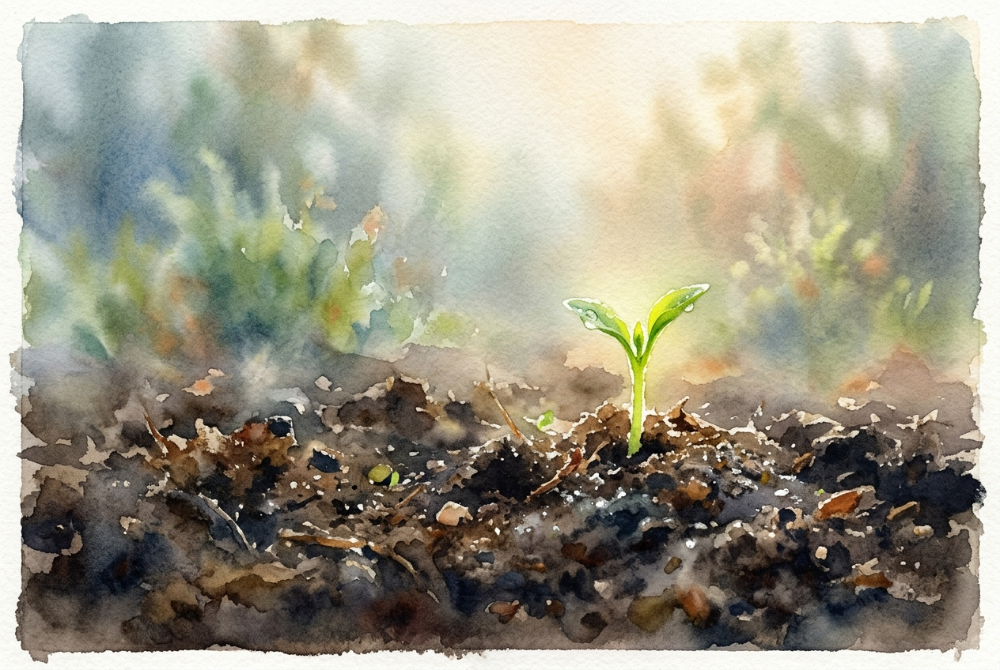

# Daily Reading: Galatians 5:22-26

*July 19, 2026*

> *(Image: A close-up view of a vibrant green shoot breaking through dark, rich soil in a sunlit garden, surrounded by soft morning mist.)*

## The Reading (NLT)

**Galatians 5:22-26**

> 22 But the Holy Spirit produces this kind of fruit in our lives: love, joy, peace, patience, kindness, goodness, faithfulness, 23 gentleness, and self-control. There is no law against these things! 24 Those who belong to Christ Jesus have nailed the passions and desires of their sinful nature to his cross and crucified them there. 25 Since we are living by the Spirit, let us follow the Spirit's leading in every part of our lives. 26 Let us not become conceited, or provoke one another, or be jealous of one another.

## The Story

Paul is writing to a community fractured by internal debates about religious laws and personal behavior. He contrasts a life driven by selfish impulses with one guided by the divine presence. Instead of giving them another checklist of rules to follow, he uses an agricultural metaphor. He describes the natural outgrowth of a life rooted in the divine as a harvest of character traits. This growth happens gradually, requiring the community to actively surrender their old, destructive habits and let the divine presence set their daily pace.

## Application for Today

We often treat character development as a project to be managed through sheer willpower. Yet, the metaphor here suggests that true transformation is more like tending a garden than building a machine. When we align our daily habits with the divine presence, these qualities naturally begin to surface in our interactions. It requires us to continually let go of our need to compete with others or prove our own superiority. Instead of forcing ourselves to be perfectly patient or kind, we are invited to simply keep in step with the steady, guiding rhythm of the divine.

---

*Scripture quotations are taken from the Holy Bible, New Living Translation, copyright © 1996, 2004, 2015 by Tyndale House Foundation. Used by permission of Tyndale House Publishers.*
