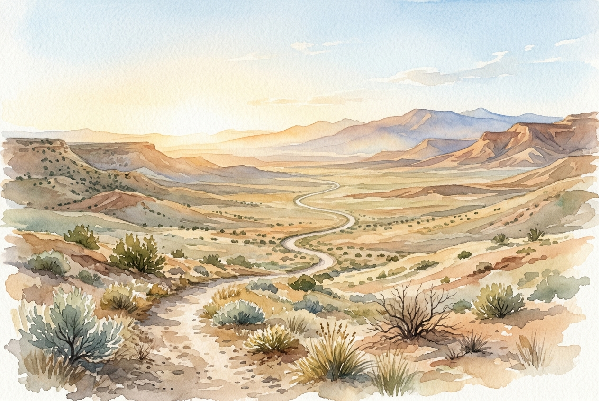

# Daily Reading: Isaiah 40:28-31

*July 19, 2026*

> *(Image: A solitary winding path stretches across a vast high desert landscape under a clear morning sky, illuminated by soft golden sunlight.)*

## The Reading (NLT)

**Isaiah 40:28-31**

> 28 Have you never heard? Have you never understood? The Lord is the everlasting God, the Creator of all the earth. He never grows weak or weary. No one can measure the depths of his understanding. 29 He gives power to the weak and strength to the powerless. 30 Even youths will become weak and tired, and young men will fall in exhaustion. 31 But those who trust in the Lord will find new strength. They will soar high on wings like eagles. They will run and not grow weary. They will walk and not faint.

## The Story

The exiled Israelites were completely exhausted. They had lost their homes, their temple, and their sense of national identity, leaving them feeling as though their creator had forgotten them entirely. In this historical moment, the prophet addresses a community running on empty, reminding them that human energy always has a limit. The physical prime of youth is notoriously fragile, prone to sudden crashes and total burnout. The prophet shifts their focus away from their own depleting reserves toward a divine source of vitality that never runs dry. The imagery moves from dramatic, soaring heights to the steady, rhythmic pace of a long walk homeward.

## Application for Today

We live in a culture that prizes endless productivity and glorifies the hustle, yet we constantly find ourselves hitting a wall. When we rely solely on our own willpower or physical stamina, we eventually stumble under the weight of our own expectations. The promise here is not that we will never face exhaustion, but that there is an enduring presence we can lean on when our personal reserves fail. Trusting in this infinite source allows us to pace ourselves for a lifetime of faith. Sometimes that looks like a burst of incredible momentum, but more often, it is simply the quiet resilience to keep walking forward without giving up. True spiritual endurance is a slow, steady reliance on grace rather than a frantic sprint.

---

*Scripture quotations are taken from the Holy Bible, New Living Translation, copyright © 1996, 2004, 2015 by Tyndale House Foundation. Used by permission of Tyndale House Publishers.*
