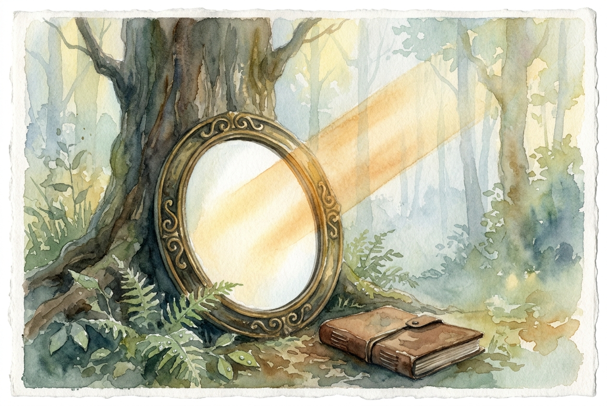

# Leitura Diária: 1 Corinthians 13

*20 de julho de 2026*

> *(Image: A polished antique mirror resting in a misty, sunlit forest, reflecting a perfectly clear and brilliant beam of warm morning light.)*

## A Leitura (PT-NVI)

**1 Corinthians 13**

> 1 Ainda que eu fale as línguas dos homens e dos anjos, se não tiver amor, serei como o sino que ressoa ou como o prato que retine. 2 Ainda que eu tenha o dom de profecia e saiba todos os mistérios e todo o conhecimento, e tenha uma fé capaz de mover montanhas, mas não tiver amor, nada serei. 3 Ainda que eu dê aos pobres tudo o que possuo e entregue o meu corpo para ser queimado, mas não tiver amor, nada disso me valerá. 4 O amor é paciente, o amor é bondoso. Não inveja, não se vangloria, não se orgulha. 5 Não maltrata, não procura seus interesses, não se ira facilmente, não guarda rancor. 6 O amor não se alegra com a injustiça, mas se alegra com a verdade. 7 Tudo sofre, tudo crê, tudo espera, tudo suporta. 8 O amor nunca perece; mas as profecias desaparecerão, as línguas cessarão, o conhecimento passará. 9 Pois em parte conhecemos e em parte profetizamos; 10 quando, porém, vier o que é perfeito, o que é imperfeito desaparecerá. 11 Quando eu era menino, falava como menino, pensava como menino e raciocinava como menino. Quando me tornei homem, deixei para trás as coisas de menino. 12 Agora, pois, vemos apenas um reflexo obscuro, como em espelho; mas, então, veremos face a face. Agora conheço em parte; então, conhecerei plenamente, da mesma forma como sou plenamente conhecido. 13 Assim, permanecem agora estes três: a fé, a esperança e o amor. O maior deles, porém, é o amor.

## A História

A igreja primitiva em Corinto era uma comunidade vibrante, porém dividida. As pessoas ali ficavam profundamente impressionadas com demonstrações espirituais espetaculares, elevando aqueles que falavam com eloquência, possuíam conhecimento profundo ou demonstravam fé intensa. Nesta carta, o autor interrompe uma discussão mais ampla sobre os papéis na comunidade para oferecer uma correção essencial. Ele remove o glamour das conquistas impressionantes e dos sacrifícios extremos. Se essas ações estiverem desconectadas do cuidado genuíno com o próximo, ele argumenta, elas são totalmente vazias. Ele apresenta a visão de uma comunidade onde o caráter importa muito mais do que a capacidade.

## Aplicação para Hoje

Vivemos em um mundo que frequentemente recompensa o desempenho, o brilhantismo e o sucesso visível. É muito fácil medir nosso próprio valor pelo que sabemos, pelo que podemos fazer ou pelo quanto sacrificamos. No entanto, este texto nos convida a avaliar nossas vidas por meio de uma métrica completamente diferente. As escolhas silenciosas e diárias de ser paciente, deixar o orgulho de lado e perdoar são as que realmente perduram. Tudo o mais que construímos ou alcançamos é temporário e incompleto. O que permanece para sempre é a forma como tratamos uns aos outros. Somos chamados a ancorar nossas vidas na única realidade que jamais desaparecerá.

---

*Citações bíblicas extraídas da Nova Versão Internacional (NVI), © 1993, 2000 por Biblica, Inc. Usado com permissão.*
