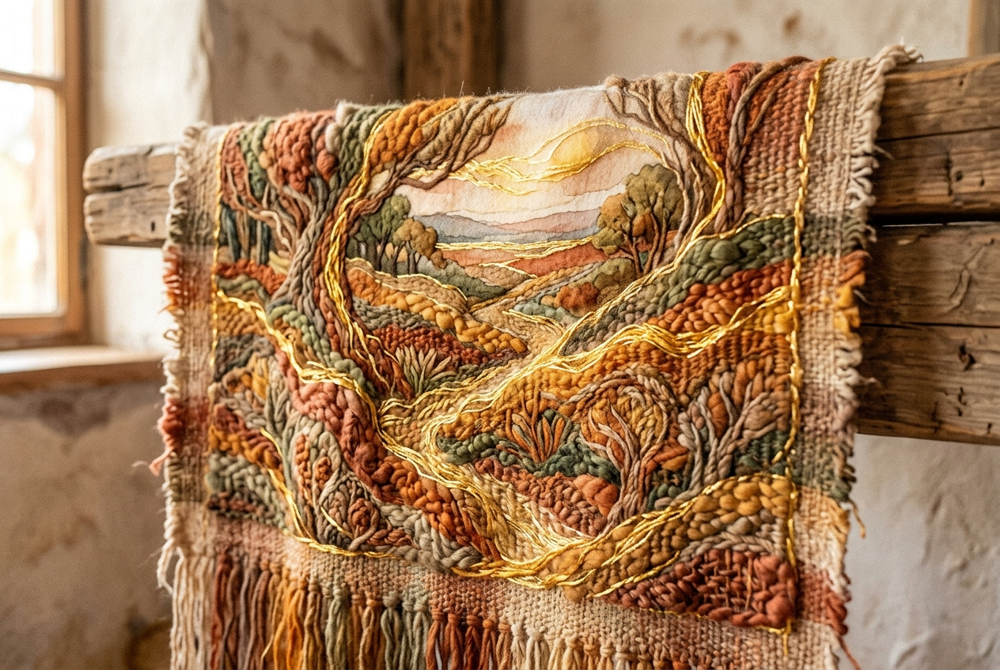

# Daily Reading: Colossians 3:12-17

*July 21, 2026*

> *(Image: A close-up of a rustic woven tapestry in warm earthy tones, with bright threads of gold binding the intricate pattern together in perfect harmony.)*

## The Reading (NLT)

**Colossians 3:12-17**

> 12 Since God chose you to be the holy people he loves, you must clothe yourselves with tenderhearted mercy, kindness, humility, gentleness, and patience. 13 Make allowance for each other's faults, and forgive anyone who offends you. Remember, the Lord forgave you, so you must forgive others. 14 Above all, clothe yourselves with love, which binds us all together in perfect harmony. 15 And let the peace that comes from Christ rule in your hearts. For as members of one body you are called to live in peace. And always be thankful. 16 Let the message about Christ, in all its richness, fill your lives. Teach and counsel each other with all the wisdom he gives. Sing psalms and hymns and spiritual songs to God with thankful hearts. 17 And whatever you do or say, do it as a representative of the Lord Jesus, giving thanks through him to God the Father.

## The Story

The letter to the Colossians was written to a young community trying to figure out how to live together. In the ancient Mediterranean, clothing was a primary indicator of identity, status, and allegiance. The writer uses this familiar imagery to describe a radical shift in how these early believers were supposed to interact. Instead of wearing markers of wealth or power, they are urged to deliberately put on virtues that foster unity. The text describes a conscious, daily decision to wrap oneself in compassion, patience, and humility. At the center of this new wardrobe is a deep affection for others, acting as the binding that holds everything else in place. The ultimate goal was not just individual morality, but building a community guided by tranquility and mutual respect.

## Application for Today

It takes intentional effort to choose gentleness when we feel wronged or to offer grace when we are hurt. The guidance to allow a deep, spiritual peace to mediate our internal conflicts acknowledges that anxiety and friction will naturally arise. When we release our need to be right or to hold onto past grievances, we make room for that peace to take charge. This is not a passive surrender, but an active decision to align our reactions with divine grace. By carrying a spirit of gratitude into our everyday tasks, ordinary moments become opportunities to reflect our highest values. We are invited to step into each day fully clothed in a unifying love.

---

*Scripture quotations are taken from the Holy Bible, New Living Translation, copyright © 1996, 2004, 2015 by Tyndale House Foundation. Used by permission of Tyndale House Publishers.*
