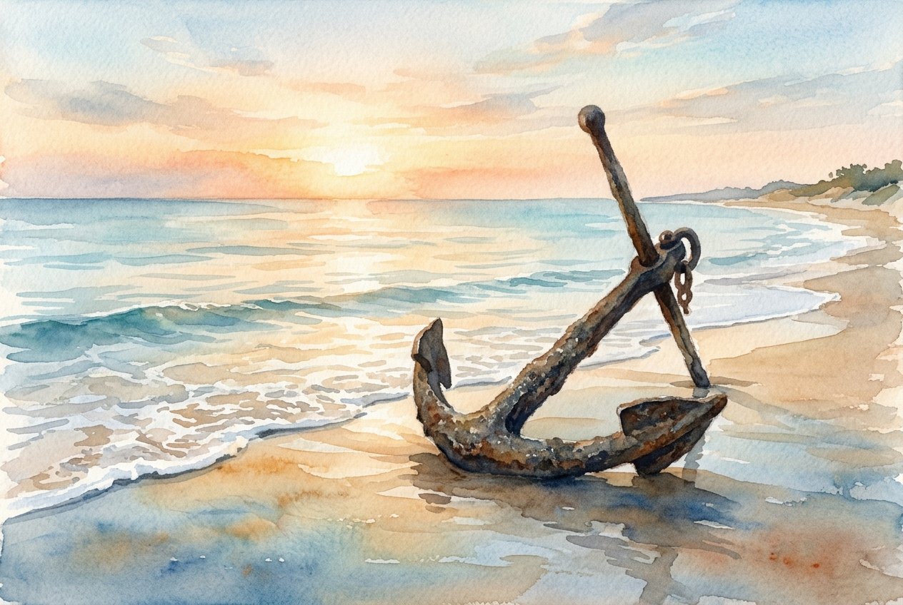

# Daily Reading: Romans 5:1-11

*July 22, 2026*

> *(Image: A heavy, weathered iron anchor resting on a tranquil, sunlit shoreline at dawn, with gentle waves softly washing over the smooth sand.)*

## The Reading (NLT)

**Romans 5:1-11**

> 1 Therefore, since we have been made right in God's sight by faith, we have peace with God because of what Jesus Christ our Lord has done for us. 2 Because of our faith, Christ has brought us into this place of undeserved privilege where we now stand, and we confidently and joyfully look forward to sharing God's glory. 3 We can rejoice, too, when we run into problems and trials, for we know that they help us develop endurance. 4 And endurance develops strength of character, and character strengthens our confident hope of salvation. 5 And this hope will not lead to disappointment. For we know how dearly God loves us, because he has given us the Holy Spirit to fill our hearts with his love. 6 When we were utterly helpless, Christ came at just the right time and died for us sinners. 7 Now, most people would not be willing to die for an upright person, though someone might perhaps be willing to die for a person who is especially good. 8 But God showed his great love for us by sending Christ to die for us while we were still sinners. 9 And since we have been made right in God's sight by the blood of Christ, he will certainly save us from God's condemnation. 10 For since our friendship with God was restored by the death of his Son while we were still his enemies, we will certainly be saved through the life of his Son. 11 So now we can rejoice in our wonderful new relationship with God because our Lord Jesus Christ has made us friends of God.

## The Story

Paul is writing to a mixed community of Jewish and Gentile believers in Rome who are trying to understand how they fit together in the divine plan. He has just spent chapters dismantling the idea that anyone can earn their way into divine favor through perfect behavior or lineage. Here, he shifts the tone from a legal argument to a profound celebration of grace. He introduces a radical concept for the ancient world by describing a deity who initiates reconciliation with humanity. In a culture where gods demanded sacrifices to appease their anger, Paul writes of a God who bridges the gap. This divine initiative happens not when people are at their best, but when they are completely estranged.

## Application for Today

We spend so much of our lives trying to prove our worth to employers, friends, and even ourselves. It is easy to project this same exhaustion onto our spiritual lives, assuming we must clean ourselves up before approaching the divine. Yet Paul insists that the foundation of our faith rests entirely on a love that reached out while we were still wandering. This unearned peace changes how we experience the inevitable struggles of life. Hardships are no longer signs of divine abandonment, but spaces where our character is forged and our hope is anchored. Because we are already held by a love that precedes our best efforts, we can face today with quiet confidence rather than anxious striving.

---

*Scripture quotations are taken from the Holy Bible, New Living Translation, copyright © 1996, 2004, 2015 by Tyndale House Foundation. Used by permission of Tyndale House Publishers.*
