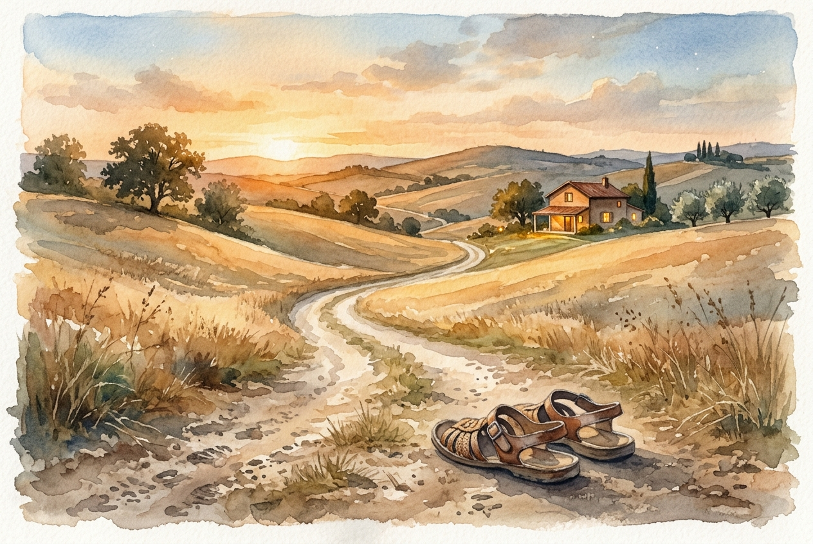

# Daily Reading: Luke 15:11-32

*July 23, 2026*

> *(Image: A dusty dirt road winding through rolling golden hills toward a warm, brightly lit house at twilight, with a pair of worn sandals resting in the foreground.)*

## The Reading (NLT)

**Luke 15:11-32**

> 11 To illustrate the point further, Jesus told them this story: A man had two sons. 12 The younger son told his father, ‘I want my share of your estate now before you die.' So his father agreed to divide his wealth between his sons. 13 A few days later this younger son packed all his belongings and moved to a distant land, and there he wasted all his money in wild living. 14 About the time his money ran out, a great famine swept over the land, and he began to starve. 15 He persuaded a local farmer to hire him, and the man sent him into his fields to feed the pigs. 16 The young man became so hungry that even the pods he was feeding the pigs looked good to him. But no one gave him anything. 17 When he finally came to his senses, he said to himself, ‘At home even the hired servants have food enough to spare, and here I am dying of hunger! 18 I will go home to my father and say, Father, I have sinned against both heaven and you, 19 and I am no longer worthy of being called your son. Please take me on as a hired servant.' 20 So he returned home to his father. And while he was still a long way off, his father saw him coming. Filled with love and compassion, he ran to his son, embraced him, and kissed him. 21 His son said to him, ‘Father, I have sinned against both heaven and you, and I am no longer worthy of being called your son.' 22 But his father said to the servants, ‘Quick! Bring the finest robe in the house and put it on him. Get a ring for his finger and sandals for his feet. 23 And kill the calf we have been fattening. We must celebrate with a feast, 24 for this son of mine was dead and has now returned to life. He was lost, but now he is found.' So the party began. 25 Meanwhile, the older son was in the fields working. When he returned home, he heard music and dancing in the house, 26 and he asked one of the servants what was going on. 27 ‘Your brother is back,' he was told, ‘and your father has killed the fattened calf. We are celebrating because of his safe return.' 28 The older brother was angry and wouldn't go in. His father came out and begged him, 29 but he replied, ‘All these years I've slaved for you and never once refused to do a single thing you told me to. And in all that time you never gave me even one young goat for a feast with my friends. 30 Yet when this son of yours comes back after squandering your money on prostitutes, you celebrate by killing the fattened calf!' 31 His father said to him, ‘Look, dear son, you have always stayed by me, and everything I have is yours. 32 We had to celebrate this happy day. For your brother was dead and has come back to life! He was lost, but now he is found!'

## The Story

In the ancient Near East, a son asking for his inheritance before his father’s death was equivalent to wishing the old man dead. Yet the father in Jesus' story grants the request, watching his youngest walk away to ruin. When the desperate son finally rehearses his apology, hoping only for a servant's wage, the father shatters every cultural norm of the day. A patriarch would never hike up his robes and sprint down a dirt road, but this father runs. He doesn't wait for the apology or put the boy on probation. He immediately restores his son's status with a robe, a ring, and a feast, while also stepping out to gently pursue his resentful older son who refuses to join the party.

## Application for Today

We often view our relationship with God through a lens of transactions and ledgers. Like the younger brother, we think we have to earn our way back into good graces after making a mess of things. Or, like the older brother, we believe our obedience entitles us to special treatment and gives us the right to judge others. But the father in this narrative completely ignores the math of merit. His love is aggressively proactive, rushing toward us when we are still a long way off. Whatever distance you feel today, you don't have to clean yourself up before turning around. You just have to take the first step home and let grace cover the rest of the distance.

---

*Scripture quotations are taken from the Holy Bible, New Living Translation, copyright © 1996, 2004, 2015 by Tyndale House Foundation. Used by permission of Tyndale House Publishers.*
