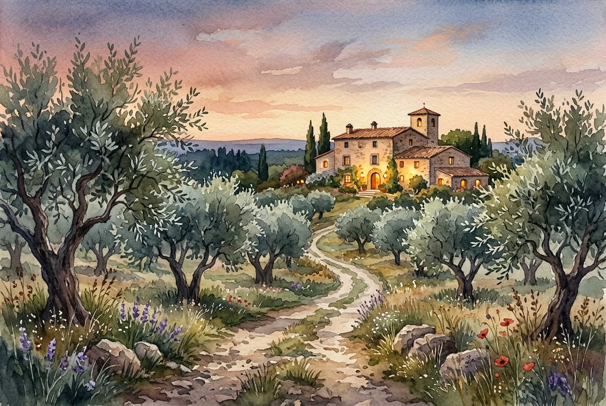

# Daily Reading: John 14:1-7

*July 23, 2026*

> *(Image: A serene dirt path winding through an ancient olive grove toward a brightly lit, welcoming stone estate at dusk.)*

## The Reading (NLT)

**John 14:1-7**

> 1 Don't let your hearts be troubled. Trust in God, and trust also in me. 2 There is more than enough room in my Father's home. If this were not so, would I have told you that I am going to prepare a place for you? 3 When everything is ready, I will come and get you, so that you will always be with me where I am. 4 And you know the way to where I am going. 5 No, we don't know, Lord, Thomas said. We have no idea where you are going, so how can we know the way? 6 Jesus told him, I am the way, the truth, and the life. No one can come to the Father except through me. 7 If you had really known me, you would know who my Father is. From now on, you do know him and have seen him!

## The Story

The disciples are sitting in the shadow of a profound disruption. They have just heard predictions of betrayal and departure, leaving them anxious about their future and their safety. In the ancient world, a patriarch's estate was a place of ultimate security, often expanding to accommodate a growing extended family. Jesus uses this familiar cultural image to reorient their panic. He speaks of a sprawling, permanent home with endless space, assuring them that His departure is not an abandonment but a preparation. When Thomas voices the group's collective confusion about the route, the response shifts the focus from a map to a person. The destination and the journey are bound up entirely in their relationship with Him.

## Application for Today

We often navigate our spiritual lives as if we are looking for a hidden set of coordinates. When the future feels uncertain or our current circumstances unravel, we panic, demanding clear directions and a predictable timeline. Yet the comfort offered here is not a step-by-step itinerary, but an invitation to profound trust. We do not have to earn our space or figure out the exact route on our own. The way forward is simply remaining close to the one who already knows the Father perfectly. In our deepest moments of anxiety, we are reminded that there is already a place secured for us. The path home is not a method we master, but a relationship we rest in.

---

*Scripture quotations are taken from the Holy Bible, New Living Translation, copyright © 1996, 2004, 2015 by Tyndale House Foundation. Used by permission of Tyndale House Publishers.*
