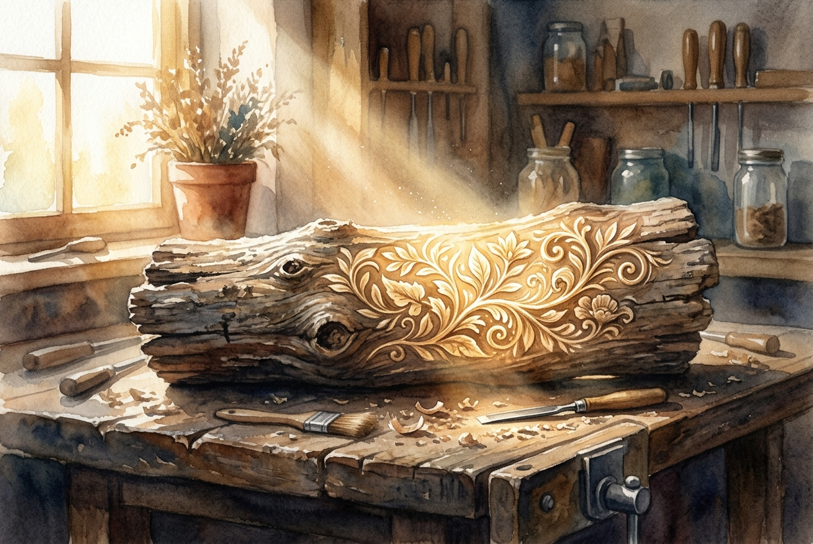

# Daily Reading: Ephesians 2:1-10

*July 24, 2026*

> *(Image: A piece of rough, weathered wood resting on a workbench, with a warm, golden beam of light illuminating intricate, beautiful carvings beginning to emerge from the raw material.)*

## The Reading (NLT)

**Ephesians 2:1-10**

> 1 Once you were dead because of your disobedience and your many sins. 2 You used to live in sin, just like the rest of the world, obeying the devil the commander of the powers in the unseen world. He is the spirit at work in the hearts of those who refuse to obey God. 3 All of us used to live that way, following the passionate desires and inclinations of our sinful nature. By our very nature we were subject to God's anger, just like everyone else. 4 But God is so rich in mercy, and he loved us so much, 5 that even though we were dead because of our sins, he gave us life when he raised Christ from the dead. (It is only by God's grace that you have been saved!) 6 For he raised us from the dead along with Christ and seated us with him in the heavenly realms because we are united with Christ Jesus. 7 So God can point to us in all future ages as examples of the incredible wealth of his grace and kindness toward us, as shown in all he has done for us who are united with Christ Jesus. 8 God saved you by his grace when you believed. And you can't take credit for this; it is a gift from God. 9 Salvation is not a reward for the good things we have done, so none of us can boast about it. 10 For we are God's masterpiece. He has created us anew in Christ Jesus, so we can do the good things he planned for us long ago.

## The Story

The author of Ephesians paints a stark contrast of the human condition, splitting history into a definitive before and after. He describes a past state defined by spiritual numbness, captivity to destructive cultural currents, and total alienation from the divine life. This grim assessment is completely upended by a massive pivot in the text: the rich mercy of God. Instead of leaving humanity in a cycle of despair, the Creator intervenes with an unearned rescue. This rescue isn't portrayed as a transaction or a reward for moral behavior, but as an absolute gift of grace that fundamentally alters human identity and destiny.

## Application for Today

We often try to measure our worth by our accomplishments, exhausting ourselves to prove we deserve love and belonging. This passage dismantles that endless treadmill by insisting that our rescue and renewal are entirely given, never earned. You cannot boast about a gift you simply received with open hands. Yet, this free gift does not leave us idle or passive. We are described as divine poetry, a masterpiece carefully shaped for a specific reason. The good things we are called to do aren't stepping stones to earn God's favor, but the natural outpouring of a life already made new.

---

*Scripture quotations are taken from the Holy Bible, New Living Translation, copyright © 1996, 2004, 2015 by Tyndale House Foundation. Used by permission of Tyndale House Publishers.*
