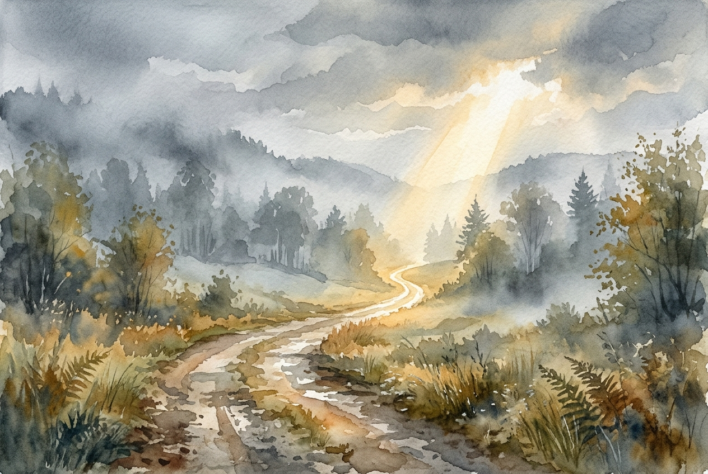

# Daily Reading: Hebrews 12:1-3

*July 24, 2026*

> *(Image: A weathered dirt path winding through a misty morning landscape, where a single bright beam of sunlight breaks through the heavy clouds to illuminate the trail ahead.)*

## The Reading (NLT)

**Hebrews 12:1-3**

> 1 Therefore, since we are surrounded by such a huge crowd of witnesses to the life of faith, let us strip off every weight that slows us down, especially the sin that so easily trips us up. And let us run with endurance the race God has set before us. 2 We do this by keeping our eyes on Jesus, the champion who initiates and perfects our faith. Because of the joy awaiting him, he endured the cross, disregarding its shame. Now he is seated in the place of honor beside God's throne. 3 Think of all the hostility he endured from sinful people; then you won't become weary and give up.

## The Story

The author of Hebrews uses the vivid imagery of a Greco-Roman athletic competition to describe the life of faith. The original audience was facing severe exhaustion and social pressure, tempted to abandon their spiritual commitments. To encourage them, the writer pictures a massive stadium filled with the faithful ancestors who have already completed their own grueling events. These predecessors are not just spectators but proof that the course can be finished. The text urges the readers to strip down like serious athletes, discarding anything that would tangle their feet or weigh them down. It frames the journey not as a short sprint, but as a grueling marathon requiring intense focus and strategic shedding of unnecessary burdens.

## Application for Today

We all accumulate heavy baggage as we navigate life, picking up habits, anxieties, or failures that slow our spiritual momentum. The invitation here is to practice a ruthless kind of unburdening, letting go of the specific things that trip us up. This is not just about moral perfection, but about clearing our vision so we can lock our eyes on the ultimate example of endurance. When we look at how Jesus navigated profound opposition and shame by focusing on the joy ahead, it recalibrates our own perspective. We are reminded that our current exhaustion is not the end of the story. By keeping our attention fixed forward, we find the second wind needed to keep moving, step by step, into the purpose set before us.

---

*Scripture quotations are taken from the Holy Bible, New Living Translation, copyright © 1996, 2004, 2015 by Tyndale House Foundation. Used by permission of Tyndale House Publishers.*
