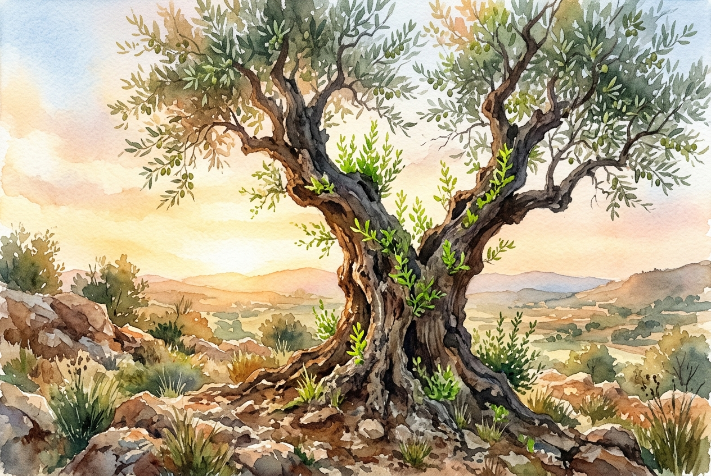

# Leitura Diária: 2 Corinthians 4:16-18

*25 de julho de 2026*

> *(Image: A weathered, ancient olive tree standing on a rocky hill, with bright, vibrant green shoots emerging from its deeply textured bark under the warm light of dawn.)*

## A Leitura (PT-NVI)

**2 Corinthians 4:16-18**

> 16 Por isso não desanimamos. Embora exteriormente estejamos a desgastar-nos, interiormente estamos sendo renovados dia após dia, 17 pois os nossos sofrimentos leves e momentâneos estão produzindo para nós uma glória eterna que pesa mais do que todos eles. 18 Assim, fixamos os olhos, não naquilo que se vê, mas no que não se vê, pois o que se vê é transitório, mas o que não se vê é eterno.

## A História

O autor desta carta conhecia a exaustão física intimamente. Escrevendo para uma comunidade agitada e obcecada por status em Corinto, ele contrasta a cultura de sucesso exterior deles com sua própria realidade de agressões, naufrágios e cansaço diário. Ainda assim, ele descreve esse implacável desgaste físico e emocional como algo notavelmente pequeno. Ele introduz uma mudança radical de perspectiva, sugerindo que a decadência externa não é a palavra final. Em vez disso, ele aponta para um processo oculto e contínuo de restauração acontecendo no mais íntimo do ser. As lutas visíveis, por mais pesadas que pareçam, são temporárias, enquanto a transformação invisível carrega um peso duradouro.

## Aplicação para Hoje

É incrivelmente fácil deixar que as dificuldades atuais ditem toda a nossa realidade. Quando a saúde falha, os relacionamentos se rompem ou o estresse diário se acumula, esses problemas visíveis exigem nossa atenção total. Este texto nos convida a praticar um tipo diferente de visão. Ele nos pede para confiar que nossa dor presente não é sem sentido, mas de alguma forma está abrindo espaço para uma resiliência profunda e duradoura. Somos encorajados a olhar além do horizonte imediato de nossas lutas. Ao focar na obra silenciosa e invisível da graça em nós, podemos encontrar força para seguir em frente, mesmo quando o mundo exterior parece estar desmoronando.

---

*Citações bíblicas extraídas da Nova Versão Internacional (NVI), © 1993, 2000 por Biblica, Inc. Usado com permissão.*
