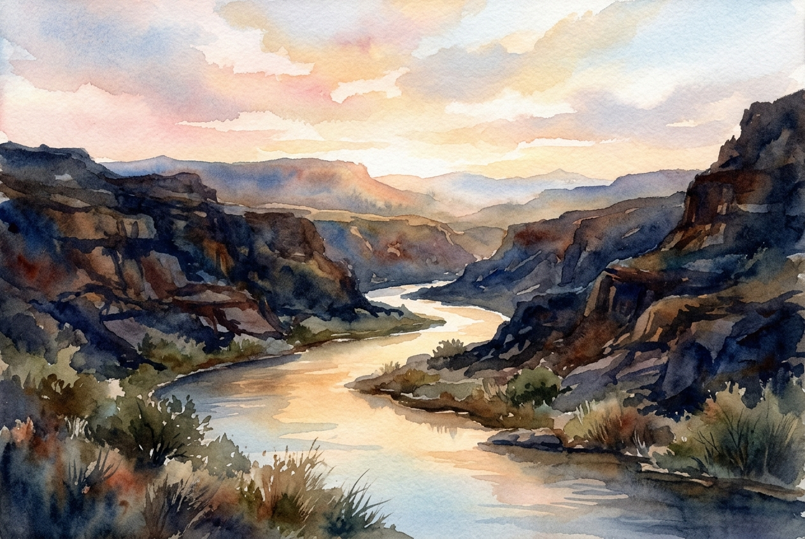

# Leitura Diária: Psalm 46

*26 de julho de 2026*

> *(Image: A serene, glowing river flowing gently through a dark, rugged canyon under a breaking dawn, painted in soft, contemplative watercolors.)*

## A Leitura (PT-NVI)

**Psalm 46**

> 1 Deus é o nosso refúgio e a nossa fortaleza, auxílio sempre presente na adversidade. 2 Por isso não temeremos, embora a terra trema e os montes afundem no coração do mar, 3 embora estrondem as suas águas turbulentas e os montes sejam sacudidos pela sua fúria. Pausa 4 Há um rio cujos canais alegram a cidade de Deus, o Santo Lugar onde habita o Altíssimo. 5 Deus nela está! Não será abalada! Deus vem em seu auxílio desde o romper da manhã. 6 Nações se agitam, reinos se abalam; ele ergue a voz, e a terra se derrete. 7 O Senhor dos Exércitos está conosco; o Deus de Jacó é a nossa torre segura. Pausa 8 Venham! Vejam as obras do Senhor, seus feitos estarrecedores na terra. 9 Ele dá fim às guerras até os confins da terra; quebra o arco e despedaça a lança, destrói os escudos com fogo. 10 "Parem de lutar! Saibam que eu sou Deus! Serei exaltado entre as nações, serei exaltado na terra. " 11 O Senhor dos Exércitos está conosco; o Deus de Jacó é a nossa torre segura. Pausa

## A História

Na antiguidade, o mar costumava ser visto como um símbolo de caos indomável, uma força aterrorizante capaz de engolir montanhas e destruir qualquer sensação de segurança. O salmista contrasta essa água violenta e barulhenta com um rio manso e invisível que sustenta a morada do divino. Enquanto as nações se enfurecem e as estruturas políticas desmoronam como penhascos, a presença do Criador permanece totalmente inabalável. O texto pinta um quadro vívido de um mundo que está ativamente ruindo, mas introduz uma narrativa surpreendente de paz profunda e inegociável. No antigo Oriente Próximo, uma cidade sitiada dependia inteiramente de sua fonte de água oculta para sobreviver. Esta canção sugere que a sobrevivência não depende da espessura das muralhas, mas da presença oculta que flui dentro delas.

## Aplicação para Hoje

Muitas vezes sentimos que o chão está cedendo sob nossos pés, seja por uma crise pessoal ou pelo ruído implacável da instabilidade global. O convite aqui não é fingir que o caos não é real, mas encontrar nosso centro de gravidade em outro lugar. Quando o texto nos orienta a parar de lutar, é na verdade um chamado para largarmos nossas armas e deixarmos de tentar controlar freneticamente o incontrolável. Somos convidados a reconhecer que o poder supremo do universo não se encontra na tempestade mais barulhenta, mas em uma presença silenciosa e sustentadora. Você não precisa manter o mundo inteiro de pé hoje. Você pode simplesmente abrir mão da necessidade de consertar tudo e permitir ser amparado por aquele que tem o poder de pôr fim a todas as guerras.

---

*Citações bíblicas extraídas da Nova Versão Internacional (NVI), © 1993, 2000 por Biblica, Inc. Usado com permissão.*
