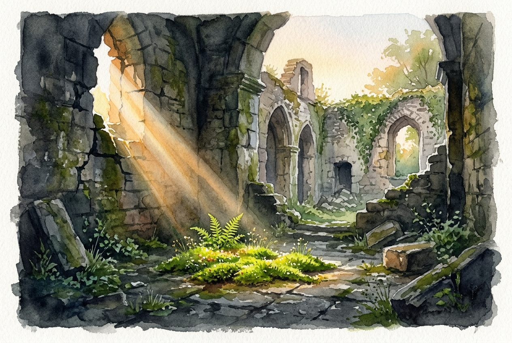

# Daily Reading: Lamentations 3:22-26

*July 26, 2026*

> *(Image: A single ray of warm morning light breaking through the cracked stone walls of an ancient ruined courtyard illuminating a small patch of green moss.)*

## The Reading (NLT)

**Lamentations 3:22-26**

> 22 The faithful love of the Lord never ends! His mercies never cease. 23 Great is his faithfulness; his mercies begin afresh each morning. 24 I say to myself, The Lord is my inheritance; therefore, I will hope in him! 25 The Lord is good to those who depend on him, to those who search for him. 26 So it is good to wait quietly for salvation from the Lord.

## The Story

Lamentations is a brutal and unflinching account of total loss. It describes the complete destruction of Jerusalem where an entire community lost their homes, their sacred spaces, and their security. The poem originates from the ashes of a devastated city surrounded by overwhelming grief. Yet right in the structural center of these five dirges the tone suddenly shifts. The narrator makes a deliberate choice to focus on something deeper than the surrounding disaster. In a landscape where everything has been consumed by violence the writer recognizes a sustaining love that cannot be exhausted. This realization brings a profound stillness to a chaotic reality.

## Application for Today

We all face seasons that feel like walking through the wreckage of our own plans or security. When everything around us shatters it is easy to believe the darkness is permanent. The writer of this ancient poem offers a different rhythm for survival. We are invited to look for the quiet daily renewal of grace that arrives even on our hardest days. Recognizing this does not instantly rebuild what was lost but it changes how we sit in the waiting. We can find the strength to pause, breathe, and trust that we are held by a compassion that outlasts our deepest pain.

---

*Scripture quotations are taken from the Holy Bible, New Living Translation, copyright © 1996, 2004, 2015 by Tyndale House Foundation. Used by permission of Tyndale House Publishers.*
