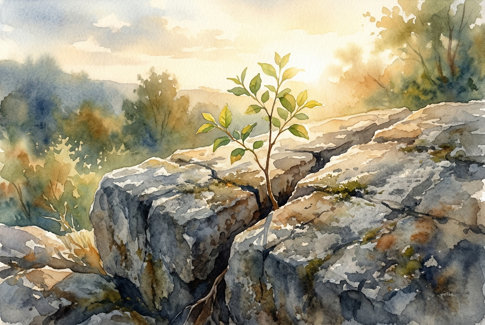

# Daily Reading: Romans 5:1-11

*July 27, 2026*

> *(Image: A resilient green sapling growing through a crack in weathered gray stone, bathed in warm golden morning sunlight.)*

## The Reading (NLT)

**Romans 5:1-11**

> 1 Therefore, since we have been made right in God's sight by faith, we have peace with God because of what Jesus Christ our Lord has done for us. 2 Because of our faith, Christ has brought us into this place of undeserved privilege where we now stand, and we confidently and joyfully look forward to sharing God's glory. 3 We can rejoice, too, when we run into problems and trials, for we know that they help us develop endurance. 4 And endurance develops strength of character, and character strengthens our confident hope of salvation. 5 And this hope will not lead to disappointment. For we know how dearly God loves us, because he has given us the Holy Spirit to fill our hearts with his love. 6 When we were utterly helpless, Christ came at just the right time and died for us sinners. 7 Now, most people would not be willing to die for an upright person, though someone might perhaps be willing to die for a person who is especially good. 8 But God showed his great love for us by sending Christ to die for us while we were still sinners. 9 And since we have been made right in God's sight by the blood of Christ, he will certainly save us from God's condemnation. 10 For since our friendship with God was restored by the death of his Son while we were still his enemies, we will certainly be saved through the life of his Son. 11 So now we can rejoice in our wonderful new relationship with God because our Lord Jesus Christ has made us friends of God.

## The Story

In his letter to the believers in Rome, Paul shifts from a theological argument about faith to the profound reality of what that faith produces. The ancient world often viewed the divine as something to be appeased through perfect behavior or sacrifices. Paul introduces a radical alternative, describing a God who initiates a rescue mission for people who were entirely hostile and helpless. He outlines a chain reaction where difficult circumstances are no longer signs of divine anger, but rather the very soil where resilience and character grow. This progression ultimately blossoms into a hope that stands firm. The foundation of this new reality is a love given freely, long before anyone could ever deserve it.

## Application for Today

We spend so much of our lives trying to prove our worth, hoping that if we are just good enough, we will be loved. This passage invites us to lay down that exhausting effort and step into a relationship defined by grace. The peace described here is not a fragile truce that depends on our perfect behavior, but a secure standing built entirely on divine initiative. When difficult seasons arrive, they do not mean we have been abandoned or punished. Instead, they become spaces where a deep, unshakable hope is forged within us. We can breathe easily today, knowing that our reconciliation is complete and our standing is secure.

---

*Scripture quotations are taken from the Holy Bible, New Living Translation, copyright © 1996, 2004, 2015 by Tyndale House Foundation. Used by permission of Tyndale House Publishers.*
