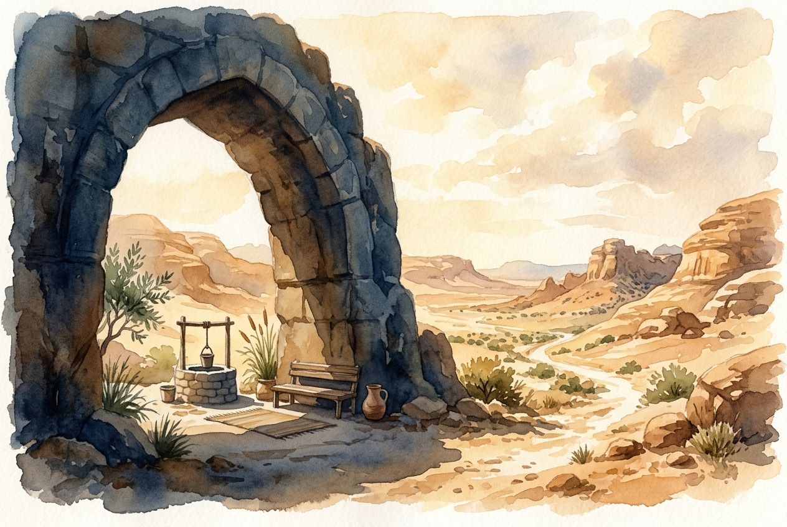

# Daily Reading: Psalm 91

*July 27, 2026*

> *(Image: A massive, ancient stone archway casts a deep, cool shadow over a quiet resting place in the middle of a sunbaked, rugged desert landscape.)*

## The Reading (NLT)

**Psalm 91**

> 1 Those who live in the shelter of the Most High will find rest in the shadow of the Almighty. 2 This I declare about the Lord: He alone is my refuge, my place of safety; he is my God, and I trust him. 3 For he will rescue you from every trap and protect you from deadly disease. 4 He will cover you with his feathers. He will shelter you with his wings. His faithful promises are your armor and protection. 5 Do not be afraid of the terrors of the night, nor the arrow that flies in the day. 6 Do not dread the disease that stalks in darkness, nor the disaster that strikes at midday. 7 Though a thousand fall at your side, though ten thousand are dying around you, these evils will not touch you. 8 Just open your eyes, and see how the wicked are punished. 9 If you make the Lord your refuge, if you make the Most High your shelter, 10 no evil will conquer you; no plague will come near your home. 11 For he will order his angels to protect you wherever you go. 12 They will hold you up with their hands so you won't even hurt your foot on a stone. 13 You will trample upon lions and cobras; you will crush fierce lions and serpents under your feet! 14 The Lord says, I will rescue those who love me. I will protect those who trust in my name. 15 When they call on me, I will answer; I will be with them in trouble. I will rescue and honor them. 16 I will reward them with a long life and give them my salvation.

## The Story

The ancient psalmist paints a vivid picture of vulnerability. In a world without modern medicine or advanced defense systems, threats were immediate and terrifying. Nighttime brought the fear of unseen predators or sudden raids, while the daylight offered no guarantee of safety from disease or conflict. Yet, in the midst of this precarious existence, the writer envisions an impenetrable fortress. This sanctuary is not built with stone or mortar, but is found entirely in the character of the Divine. The imagery shifts from grand fortresses to the intimate, tender picture of a mother bird shielding her young. It is a profound declaration that true security is rooted in presence rather than mere circumstance.

## Application for Today

We still live in a world filled with unpredictable dangers and sudden anxieties. While our modern threats might look different than the arrows or wild animals of the ancient Near East, the human desire for an absolute guarantee of safety remains unchanged. This passage invites us to redefine what it means to be truly secure. It does not promise a life completely free from hardship, but rather offers a profound peace that sustains us through it. When we choose to dwell in the awareness of God's presence, our panic begins to lose its grip. We find a quiet confidence that holds us steady, knowing that we are deeply known and ultimately held. This is the kind of rest that allows us to walk through our days with resilient hope.

---

*Scripture quotations are taken from the Holy Bible, New Living Translation, copyright © 1996, 2004, 2015 by Tyndale House Foundation. Used by permission of Tyndale House Publishers.*
