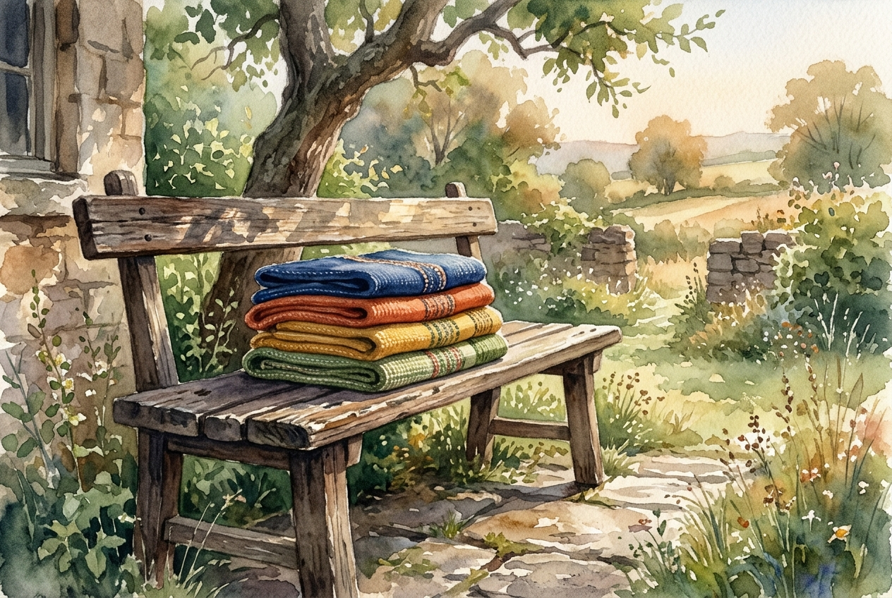

# Daily Reading: Colossians 3:12-17

*July 28, 2026*

> *(Image: A stack of simple, brightly colored woven garments resting on a weathered wooden bench in soft morning light.)*

## The Reading (NLT)

**Colossians 3:12-17**

> 12 Since God chose you to be the holy people he loves, you must clothe yourselves with tenderhearted mercy, kindness, humility, gentleness, and patience. 13 Make allowance for each other's faults, and forgive anyone who offends you. Remember, the Lord forgave you, so you must forgive others. 14 Above all, clothe yourselves with love, which binds us all together in perfect harmony. 15 And let the peace that comes from Christ rule in your hearts. For as members of one body you are called to live in peace. And always be thankful. 16 Let the message about Christ, in all its richness, fill your lives. Teach and counsel each other with all the wisdom he gives. Sing psalms and hymns and spiritual songs to God with thankful hearts. 17 And whatever you do or say, do it as a representative of the Lord Jesus, giving thanks through him to God the Father.

## The Story

In the ancient Mediterranean, clothing was an immediate indicator of status, wealth, and identity. When the early church formed, it brought together people from radically different social strata, from enslaved people to wealthy merchants. In his letter to the Colossian community, Paul uses the metaphor of getting dressed to describe how these diverse individuals should treat one another. Instead of putting on garments that signal power or importance, they are instructed to wear virtues that require setting ego aside. The fabric of their new community is woven from deliberate acts of grace, held together by a love that bridges deep cultural divides.

## Application for Today

We wake up every day and choose what to wear, but we also choose how we will carry ourselves in the world. The virtues listed in this letter, such as patience, humility, and a readiness to forgive, are not passive traits. They are intentional choices that often run counter to a culture that prizes self-promotion and quick retaliation. When we choose to bear with the people around us, we are actively participating in a different way of living. Letting peace rule our hearts means making space for gratitude and allowing the wisdom of our faith to guide our everyday interactions. Whether we are speaking, working, or simply listening, our lives can reflect the quiet strength of a community bound by love.

---

*Scripture quotations are taken from the Holy Bible, New Living Translation, copyright © 1996, 2004, 2015 by Tyndale House Foundation. Used by permission of Tyndale House Publishers.*
