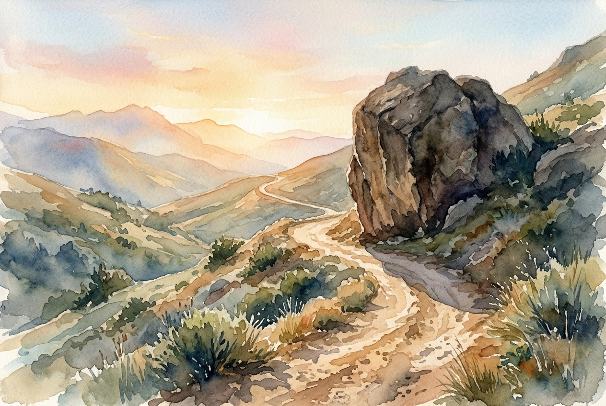

# Daily Reading: Psalm 121

*July 29, 2026*

> *(Image: A dusty, winding mountain path illuminated by the soft, warm light of dawn, with a large, sheltering rock casting a deep, protective shadow over the trail.)*

## The Reading (NLT)

**Psalm 121**

> 1 I look up to the mountainsdoes my help come from there? 2 My help comes from the Lord, who made heaven and earth! 3 He will not let you stumble; the one who watches over you will not slumber. 4 Indeed, he who watches over Israel never slumbers or sleeps. 5 The Lord himself watches over you! The Lord stands beside you as your protective shade. 6 The sun will not harm you by day, nor the moon at night. 7 The Lord keeps you from all harm and watches over your life. 8 The Lord keeps watch over you as you come and go, both now and forever.

## The Story

Ancient pilgrims sang this song as they embarked on the steep, dangerous journey toward Jerusalem. The mountains looming on the horizon were beautiful but deeply intimidating, often hiding bandits, treacherous terrain, and harsh elements. As travelers looked up at those peaks, they naturally wondered how they would survive the vulnerability of the road. The song redirects their gaze past the immediate dangers to the Maker of the landscape itself. It reminds the travelers that they are not relying on their own strength or luck, but on a Guardian who never suffers from fatigue or distraction.

## Application for Today

We all face journeys that make us feel incredibly small and exposed. When the obstacles ahead look like impassable terrain, it is easy to become obsessed with our own inadequacy or to frantically search for a quick fix. This ancient song invites us to shift our attention away from the scale of our problems and toward the steady, enduring presence of the One who walks beside us. We are offered a relationship with a God who provides shelter in the blistering heat and watches over our most vulnerable moments. Knowing we are held by this kind of relentless care frees us to take the next step forward, trusting we are never traveling alone.

---

*Scripture quotations are taken from the Holy Bible, New Living Translation, copyright © 1996, 2004, 2015 by Tyndale House Foundation. Used by permission of Tyndale House Publishers.*
