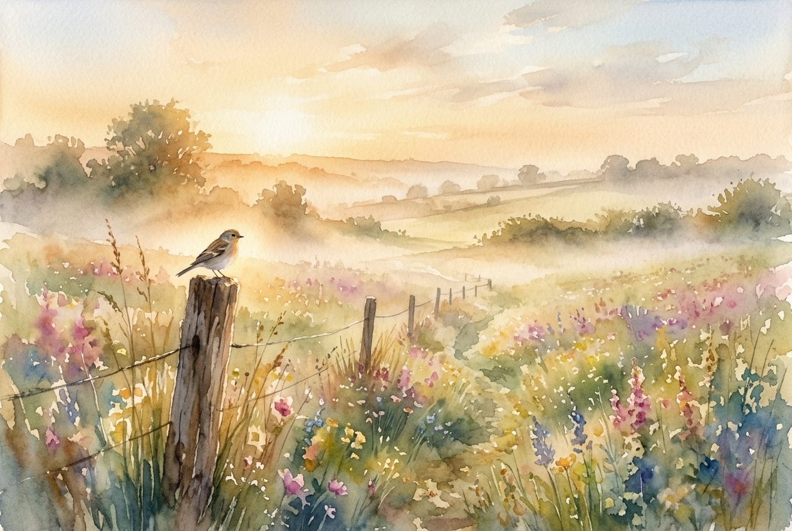

# Leitura Diária: Matthew 6:25-34

*30 de julho de 2026*

> *(Image: A gentle morning mist lifting over a lush field of wildflowers, with soft golden sunlight illuminating a single small bird resting on a weathered wooden fence post.)*

## A Leitura (PT-NVI)

**Matthew 6:25-34**

> 25 "Portanto eu lhes digo: não se preocupem com suas próprias vidas, quanto ao que comer ou beber; nem com seus próprios corpos, quanto ao que vestir. Não é a vida mais importante do que a comida, e o corpo mais importante do que a roupa? 26 Observem as aves do céu: não semeiam nem colhem nem armazenam em celeiros; contudo, o Pai celestial as alimenta. Não têm vocês muito mais valor do que elas? 27 Quem de vocês, por mais que se preocupe, pode acrescentar uma hora que seja à sua vida? 28 "Por que vocês se preocupam com roupas? Vejam como crescem os lírios do campo. Eles não trabalham nem tecem. 29 Contudo, eu lhes digo que nem Salomão, em todo o seu esplendor, vestiu-se como um deles. 30 Se Deus veste assim a erva do campo, que hoje existe e amanhã é lançada ao fogo, não vestirá muito mais a vocês, homens de pequena fé? 31 Portanto, não se preocupem, dizendo: ‘Que vamos comer? ’ ou ‘que vamos beber? ’ ou ‘que vamos vestir? ’ 32 Pois os pagãos é que correm atrás dessas coisas; mas o Pai celestial sabe que vocês precisam delas. 33 Busquem, pois, em primeiro lugar o Reino de Deus e a sua justiça, e todas essas coisas lhes serão acrescentadas. 34 Portanto, não se preocupem com o amanhã, pois o amanhã se preocupará consigo mesmo. Basta a cada dia o seu próprio mal".

## A História

Na cultura agrária da Galileia do primeiro século, a sobrevivência diária era uma realidade dura para a maioria das pessoas que ouviam os ensinamentos nas encostas. A agricultura de subsistência e o trabalho braçal significavam que uma colheita ruim ou a falta do salário diário ameaçavam imediatamente o bem-estar de uma família inteira. Ao direcionar o olhar da multidão para a natureza ao redor, a mensagem desloca a atenção da escassez econômica para os ritmos abundantes da criação. A observação de elementos comuns, como o voo das aves e o desabrochar das flores silvestres, serve para ilustrar uma verdade teológica profunda sobre o cuidado divino. O argumento caminha do menor para o maior: se o Criador sustenta até os elementos mais passageiros da natureza, os seres humanos ocupam um lugar de imensa segurança na ordem divina. Esse ensino confrontava diretamente a busca ansiosa por controle que dominava tanto os camponeses quanto a elite daquela época.

## Aplicação para Hoje

A vida moderna frequentemente se assemelha a um ciclo interminável de antecipação de crises futuras, o que nos deixa exaustos antes mesmo de o amanhã chegar. Gastamos uma quantidade imensa de energia emocional tentando controlar resultados que, no fim das contas, estão fora do nosso alcance. O texto nos convida a uma reorientação radical da nossa atenção, trazendo o foco de volta para o momento atual e para a presença constante de Deus. Confiar na provisão divina não significa abandonar nossas responsabilidades, mas sim recusar que a ansiedade dite nossas escolhas diárias. Quando priorizamos os valores do Reino, como a compaixão e a justiça, a necessidade frenética de garantir nossa própria segurança começa a perder a força. Somos libertos para lidar com os desafios de hoje com graça, descansando na certeza de que o futuro repousa nas mãos daquele que sustenta o mundo.

---

*Citações bíblicas extraídas da Nova Versão Internacional (NVI), © 1993, 2000 por Biblica, Inc. Usado com permissão.*
