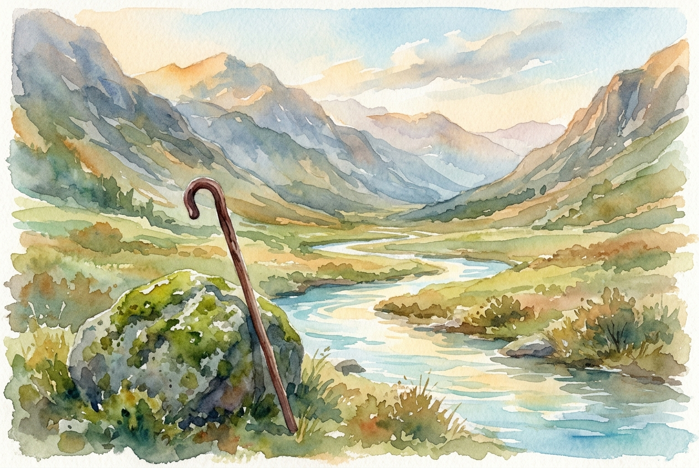

# Daily Reading: Psalm 23

*July 30, 2026*

> *(Image: A quiet, sunlit stream winding through a rugged mountain valley, with a solitary wooden walking stick resting against a mossy rock in the foreground.)*

## The Reading (NLT)

**Psalm 23**

> 1 The Lord is my shepherd; I have all that I need. 2 He lets me rest in green meadows; he leads me beside peaceful streams. 3 He renews my strength. He guides me along right paths, bringing honor to his name. 4 Even when I walk through the darkest valley, I will not be afraid, for you are close beside me. Your rod and your staff protect and comfort me. 5 You prepare a feast for me in the presence of my enemies. You honor me by anointing my head with oil. My cup overflows with blessings. 6 Surely your goodness and unfailing love will pursue me all the days of my life, and I will live in the house of the Lord forever.

## The Story

In the ancient Near East, a shepherd's role was profoundly relational and protective, not just agricultural. The rugged landscape of Judea was full of steep ravines and arid stretches where finding safe grazing required deep knowledge of the terrain. The poet draws on this lived reality to depict a Divine caretaker who actively secures the flock's well-being. This care then shifts into the imagery of a gracious host extending radical hospitality to a weary traveler. Even when surrounded by active threats, the guest experiences safety, honor, and an abundance that defies the harshness of the outside world.

## Application for Today

We often exhaust ourselves anticipating the next crisis or worrying about resources that seem scarce. Yet this ancient song invites us into a profound awareness of the care provided in the present moment. True security does not come from avoiding life's difficult terrain, but from trusting the steady companion who walks alongside us. When we stop trying to outmaneuver every danger on our own, we discover pockets of unexpected peace right in the middle of our struggles. We are invited to simply accept the generous hospitality offered to us, knowing we are fiercely protected.

---

*Scripture quotations are taken from the Holy Bible, New Living Translation, copyright © 1996, 2004, 2015 by Tyndale House Foundation. Used by permission of Tyndale House Publishers.*
