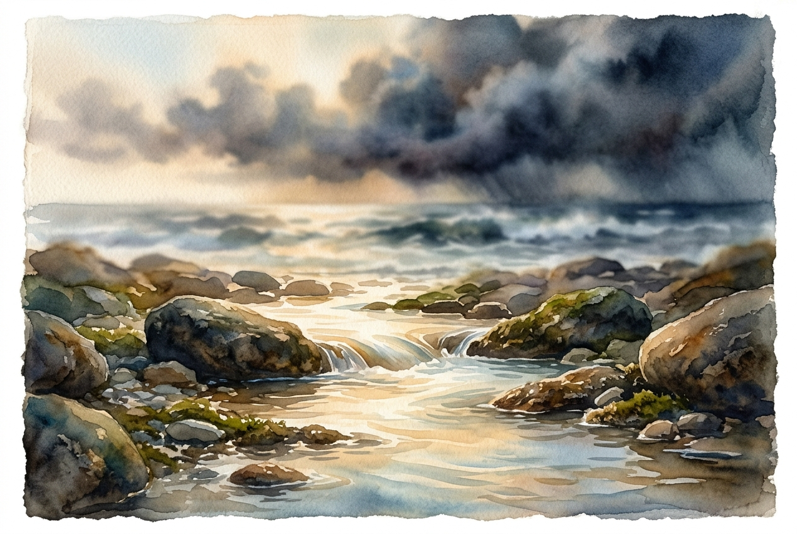

# Leitura Diária: Psalm 46

*31 de julho de 2026*

> *(Image: A serene, luminous stream of water flowing smoothly over solid, ancient stone in the foreground, while a dark, turbulent ocean storm churns softly out of focus in the distance.)*

## A Leitura (PT-NVI)

**Psalm 46**

> 1 Deus é o nosso refúgio e a nossa fortaleza, auxílio sempre presente na adversidade. 2 Por isso não temeremos, embora a terra trema e os montes afundem no coração do mar, 3 embora estrondem as suas águas turbulentas e os montes sejam sacudidos pela sua fúria. Pausa 4 Há um rio cujos canais alegram a cidade de Deus, o Santo Lugar onde habita o Altíssimo. 5 Deus nela está! Não será abalada! Deus vem em seu auxílio desde o romper da manhã. 6 Nações se agitam, reinos se abalam; ele ergue a voz, e a terra se derrete. 7 O Senhor dos Exércitos está conosco; o Deus de Jacó é a nossa torre segura. Pausa 8 Venham! Vejam as obras do Senhor, seus feitos estarrecedores na terra. 9 Ele dá fim às guerras até os confins da terra; quebra o arco e despedaça a lança, destrói os escudos com fogo. 10 "Parem de lutar! Saibam que eu sou Deus! Serei exaltado entre as nações, serei exaltado na terra. " 11 O Senhor dos Exércitos está conosco; o Deus de Jacó é a nossa torre segura. Pausa

## A História

A poesia hebraica antiga frequentemente usava o mar agitado e imprevisível como símbolo máximo de caos e destruição. O salmista contrasta essa imagem aterrorizante de montanhas desmoronando e oceanos rugindo com um rio suave e vivificante que flui por uma cidade segura. Este cântico antigo provavelmente foi escrito durante um período de intensa ameaça nacional, quando os impérios vizinhos disputavam o poder de forma violenta. No entanto, o autor não se concentra em estratégias militares ou muralhas defensivas. Em vez disso, o foco permanece inteiramente na presença divina como a fortaleza definitiva e inabalável. A canção convida seus primeiros ouvintes a olhar além do barulho assustador dos eventos mundiais e reconhecer uma realidade mais profunda e silenciosa.

## Aplicação para Hoje

Ainda vivemos em um mundo que parece tremer constantemente, seja por crises globais ou por turbulências pessoais. É incrivelmente fácil deixar que o estrondo das notícias diárias ou a agitação de nossas próprias agendas ditem nosso estado interior. O antigo convite para abandonar nossa luta frenética e reconhecer a presença divina continua tão urgente hoje quanto no passado. Isso não é um apelo à apatia, mas sim um chamado para abrirmos mão de nossa postura defensiva e da necessidade de controlar todos os resultados. Quando fazemos uma pausa e aquietamos a mente, podemos acessar uma estabilidade profunda que não depende das circunstâncias ao nosso redor. Descobrimos que somos sustentados por uma força muito maior do que a nossa própria ansiedade.

---

*Citações bíblicas extraídas da Nova Versão Internacional (NVI), © 1993, 2000 por Biblica, Inc. Usado com permissão.*
