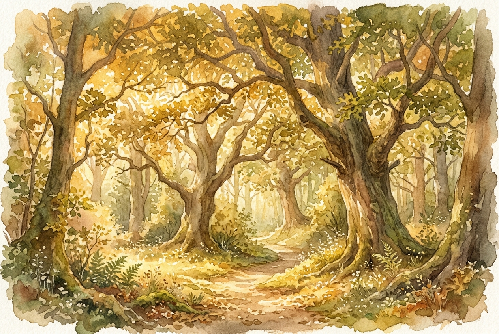

# Daily Reading: 1 John 4:7-16

*August 1, 2026*

> *(Image: A warm golden light filtering through the overlapping canopy of ancient trees casting a gentle and unified glow on the forest floor.)*

## The Reading (NLT)

**1 John 4:7-16**

> 7 Dear friends, let us continue to love one another, for love comes from God. Anyone who loves is a child of God and knows God. 8 But anyone who does not love does not know God, for God is love. 9 God showed how much he loved us by sending his one and only Son into the world so that we might have eternal life through him. 10 This is real love not that we loved God, but that he loved us and sent his Son as a sacrifice to take away our sins. 11 Dear friends, since God loved us that much, we surely ought to love each other. 12 No one has ever seen God. But if we love each other, God lives in us, and his love is brought to full expression in us. 13 And God has given us his Spirit as proof that we live in him and he in us. 14 Furthermore, we have seen with our own eyes and now testify that the Father sent his Son to be the Savior of the world. 15 All who declare that Jesus is the Son of God have God living in them, and they live in God. 16 We know how much God loves us, and we have put our trust in his love. God is love, and all who live in love live in God, and God lives in them.

## The Story

In the late first century the early church was fracturing under the weight of internal divisions and competing philosophies. The writer of this letter addresses a community that is confused about how to identify true spiritual maturity. Rather than pointing to complex theology or mystical experiences the author grounds their identity in something profoundly simple yet demanding. The text insists that the very nature of the divine is defined by self-giving affection initiated first by the Creator toward humanity. Because the Creator cannot be seen with physical eyes the community's mutual care becomes the tangible proof of the divine presence. Love is presented not merely as an emotion but as the fundamental reality of the divine character.

## Application for Today

It is easy to treat faith as a private checklist of beliefs or a solitary pursuit of personal peace. Yet this passage challenges us to see our relationships as the primary arena where faith becomes real. When we choose patience over frustration or generosity over self-preservation we are doing more than just being kind. We are actually making the invisible reality of the divine visible to the people around us. Recognizing that we were loved first frees us from the pressure to manufacture this compassion on our own. We simply pass along the grace we have already been given allowing our ordinary interactions to become vessels for something eternal.

---

*Scripture quotations are taken from the Holy Bible, New Living Translation, copyright © 1996, 2004, 2015 by Tyndale House Foundation. Used by permission of Tyndale House Publishers.*
