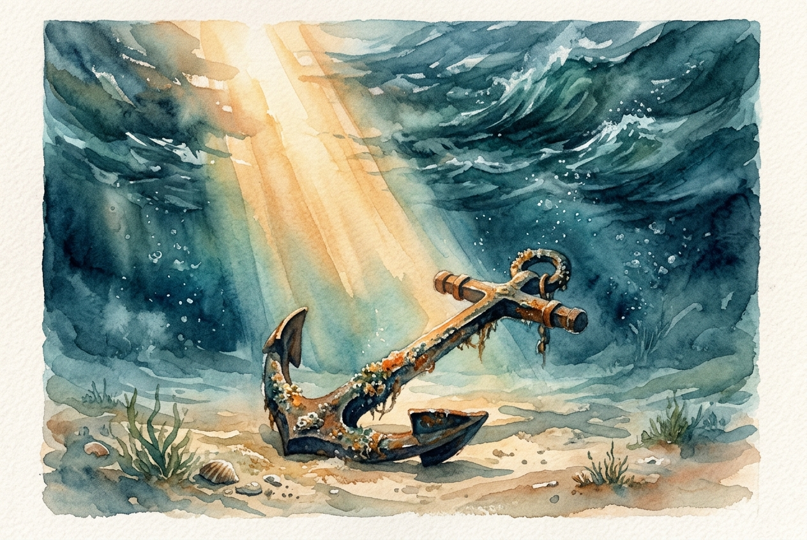

# Daily Reading: James 1:2-8

*August 1, 2026*

> *(Image: A heavy iron anchor resting on a calm, sandy ocean floor beneath turbulent waves, illuminated by a single shaft of sunlight breaking through the water.)*

## The Reading (NLT)

**James 1:2-8**

> 2 Dear brothers and sisters, when troubles of any kind come your way, consider it an opportunity for great joy. 3 For you know that when your faith is tested, your endurance has a chance to grow. 4 So let it grow, for when your endurance is fully developed, you will be perfect and complete, needing nothing. 5 If you need wisdom, ask our generous God, and he will give it to you. He will not rebuke you for asking. 6 But when you ask him, be sure that your faith is in God alone. Do not waver, for a person with divided loyalty is as unsettled as a wave of the sea that is blown and tossed by the wind. 7 Such people should not expect to receive anything from the Lord. 8 Their loyalty is divided between God and the world, and they are unstable in everything they do.

## The Story

The letter of James was written to a scattered community of early believers who were facing intense social and economic pressure. In the ancient world, trials were often viewed as a sign of divine disfavor or a punishment for wrongdoing. James radically reframes this perspective for his readers. He suggests that hardship is actually the very environment where deep spiritual maturity is forged. The goal is not merely to survive the pressure, but to allow it to develop a profound and lasting endurance. When the community lacks the perspective to see this, they are invited to ask God for wisdom, trusting in a generosity that never shames the asker.

## Application for Today

It is deeply human to want a life free from difficulty, yet our most profound growth usually happens in the crucible of challenges. When we face unexpected hurdles, the invitation is to shift our focus from seeking immediate escape to asking for the wisdom to navigate the terrain. This kind of single-minded trust acts as a heavy anchor, keeping us grounded when circumstances try to toss us around. God does not demand that we enjoy the pain, but rather offers us a steady center through it. By leaning fully into that divine generosity, we slowly develop a quiet and unshakeable resilience.

---

*Scripture quotations are taken from the Holy Bible, New Living Translation, copyright © 1996, 2004, 2015 by Tyndale House Foundation. Used by permission of Tyndale House Publishers.*
