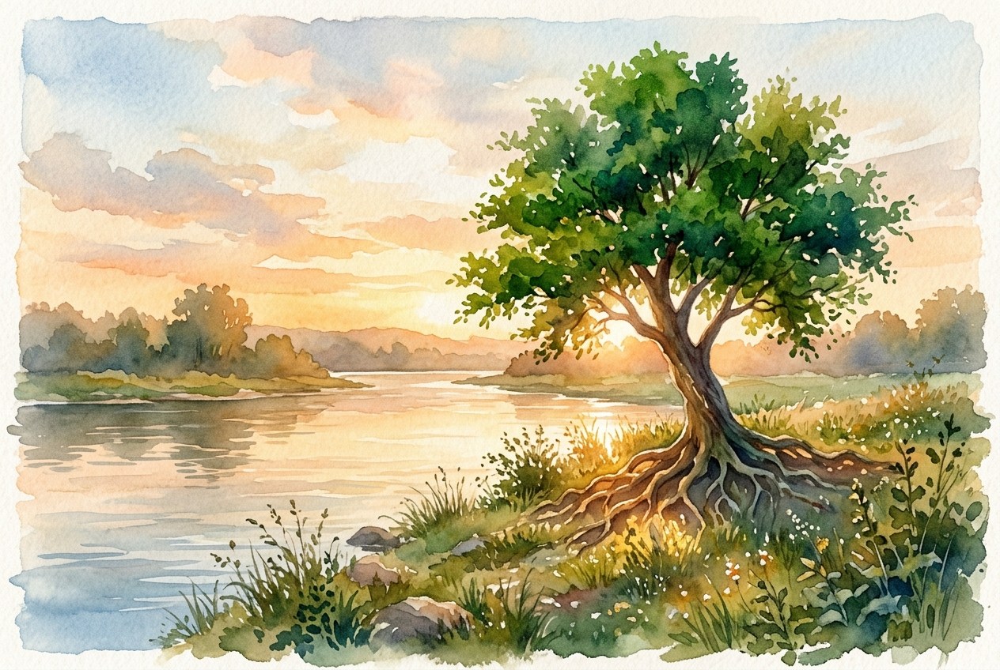

# Daily Reading: Psalm 1

*August 4, 2026*

> *(Image: A lone, vibrant green tree standing firmly on the grassy bank of a gently flowing river, with golden hour light filtering through its deep roots and lush leaves.)*

## The Reading (NLT)

**Psalm 1**

> 1 Oh, the joys of those who do not follow the advice of the wicked, or stand around with sinners, or join in with mockers. 2 But they delight in the law of the Lord, meditating on it day and night. 3 They are like trees planted along the riverbank, bearing fruit each season. Their leaves never wither, and they prosper in all they do. 4 But not the wicked! They are like worthless chaff, scattered by the wind. 5 They will be condemned at the time of judgment. Sinners will have no place among the godly. 6 For the Lord watches over the path of the godly, but the path of the wicked leads to destruction.

## The Story

The opening of the Psalms serves as a gateway to the entire collection of ancient songs and prayers. It presents a stark contrast between two ways of living, using agricultural imagery that would have been immediately familiar to an agrarian society. On one side is a deeply rooted tree drawing constant nourishment from a steady water source. On the other side is the empty husk of grain, light and easily blown away during the threshing process. This poetry invites the reader to consider where they draw their ultimate wisdom. It suggests that true stability comes from a sustained, joyful focus on divine instruction rather than the passing cynicism of the crowd.

## Application for Today

We are constantly absorbing advice, opinions, and attitudes from the world around us. It is easy to find ourselves rooted in anxiety, outrage, or the fleeting trends of our culture. The ancient wisdom here offers a different anchor for our daily lives. By choosing to intentionally focus our minds on God's enduring goodness, we plant ourselves in soil that actually sustains us. This does not mean we will never face dry seasons or harsh weather. Rather, it means that when the winds of hardship blow, we have a hidden source of life that keeps us steady.

---

*Scripture quotations are taken from the Holy Bible, New Living Translation, copyright © 1996, 2004, 2015 by Tyndale House Foundation. Used by permission of Tyndale House Publishers.*
