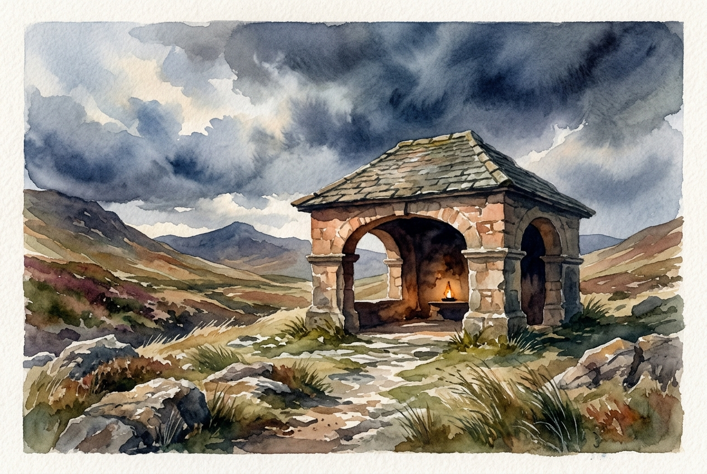

# Daily Reading: Psalm 91

*August 4, 2026*

> *(Image: A sturdy ancient stone pavilion offering deep shade and warm glowing light amidst a rugged windswept landscape under a stormy sky.)*

## The Reading (NLT)

**Psalm 91**

> 1 Those who live in the shelter of the Most High will find rest in the shadow of the Almighty. 2 This I declare about the Lord: He alone is my refuge, my place of safety; he is my God, and I trust him. 3 For he will rescue you from every trap and protect you from deadly disease. 4 He will cover you with his feathers. He will shelter you with his wings. His faithful promises are your armor and protection. 5 Do not be afraid of the terrors of the night, nor the arrow that flies in the day. 6 Do not dread the disease that stalks in darkness, nor the disaster that strikes at midday. 7 Though a thousand fall at your side, though ten thousand are dying around you, these evils will not touch you. 8 Just open your eyes, and see how the wicked are punished. 9 If you make the Lord your refuge, if you make the Most High your shelter, 10 no evil will conquer you; no plague will come near your home. 11 For he will order his angels to protect you wherever you go. 12 They will hold you up with their hands so you won't even hurt your foot on a stone. 13 You will trample upon lions and cobras; you will crush fierce lions and serpents under your feet! 14 The Lord says, I will rescue those who love me. I will protect those who trust in my name. 15 When they call on me, I will answer; I will be with them in trouble. I will rescue and honor them. 16 I will reward them with a long life and give them my salvation.

## The Story

Ancient poetry often used the physical landscape to describe spiritual realities. In a world full of unpredictable dangers, from sudden illnesses to nighttime raids, finding a secure fortress was a matter of life and death. The psalmist builds a metaphor of an impenetrable shelter, using the imagery of a mother bird shielding her young and a fortress with thick, unyielding walls. It describes a conscious choice to inhabit a space of divine protection. The song acknowledges the very real presence of terrors and plagues, but insists that there is a sanctuary greater than any threat.

## Application for Today

We still live in a world filled with sudden anxieties and unseen dangers. The promise here is not that we will never experience hardship, but that the core of who we are remains untouchable when we position our lives in divine care. Dwelling in this shelter means cultivating a daily habit of trust, returning to that quiet center when the noise of the world grows too loud. When the text speaks of the Creator being present in trouble, it reveals the true nature of this refuge. It is a relationship rather than an escape from reality, allowing us to face uncertainty knowing our deepest selves are fiercely loved.

---

*Scripture quotations are taken from the Holy Bible, New Living Translation, copyright © 1996, 2004, 2015 by Tyndale House Foundation. Used by permission of Tyndale House Publishers.*
