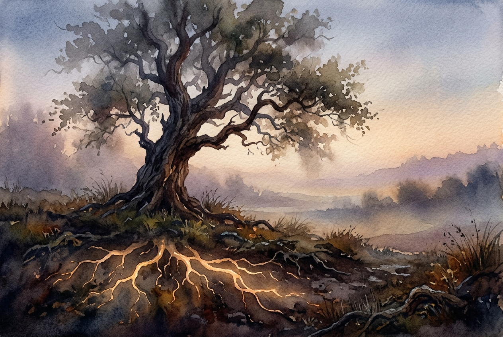

# Daily Reading: 2 Corinthians 4:16-18

*August 5, 2026*

> *(Image: A solitary ancient oak tree standing resilient in a misty fading landscape with its deep roots glowing faintly with a warm golden light beneath the dark soil.)*

## The Reading (NLT)

**2 Corinthians 4:16-18**

> 16 That is why we never give up. Though our bodies are dying, our spirits are being renewed every day. 17 For our present troubles are small and won't last very long. Yet they produce for us a glory that vastly outweighs them and will last forever! 18 So we don't look at the troubles we can see now; rather, we fix our gaze on things that cannot be seen. For the things we see now will soon be gone, but the things we cannot see will last forever.

## The Story

Paul wrote to a community well-acquainted with physical danger and social rejection. He himself had endured beatings, shipwrecks, and the relentless toll of time on his physical frame. In the ancient world, bodily suffering was often interpreted as a sign of divine disfavor or personal defeat. Yet the apostle flips this script entirely. He acknowledges the harsh reality of physical decline and present hardship without pretending the pain is an illusion. Instead, he introduces a radical theological framework where enduring such struggles actively forges an enduring, unseen resilience within the human spirit.

## Application for Today

It is incredibly easy to be consumed by what is right in front of us, whether that is failing health, financial stress, or the daily friction of life. These visible realities demand our immediate attention and often drain our energy. But we are invited to practice a different kind of vision, one that looks past the immediate decay toward a deeper spiritual transformation happening beneath the surface. This approach does not mean ignoring our pain, but rather refusing to let it dictate our ultimate reality. By anchoring our attention to the enduring presence of divine love, we find the quiet strength to keep going. The unseen world holds a weight and substance that outlasts every temporary sorrow.

---

*Scripture quotations are taken from the Holy Bible, New Living Translation, copyright © 1996, 2004, 2015 by Tyndale House Foundation. Used by permission of Tyndale House Publishers.*
