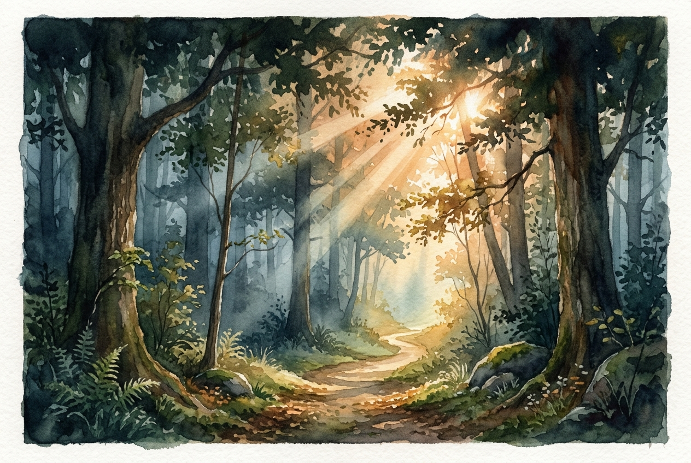

# Daily Reading: John 3:16-21

*August 7, 2026*

> *(Image: Warm morning sunlight piercing through the dense canopy of a dark, misty forest, gently illuminating a clear and inviting path forward.)*

## The Reading (NLT)

**John 3:16-21**

> 16 For this is how God loved the world: He gave his one and only Son, so that everyone who believes in him will not perish but have eternal life. 17 God sent his Son into the world not to judge the world, but to save the world through him. 18 There is no judgment against anyone who believes in him. But anyone who does not believe in him has already been judged for not believing in God's one and only Son. 19 And the judgment is based on this fact: God's light came into the world, but people loved the darkness more than the light, for their actions were evil. 20 All who do evil hate the light and refuse to go near it for fear their sins will be exposed. 21 But those who do what is right come to the light so others can see that they are doing what God wants.

## The Story

When a prominent religious leader visited Jesus under the cover of night, their conversation quickly turned to the stark contrast between light and darkness. In a culture expecting a Messiah to arrive with strict judgment for the wicked, Jesus described a profoundly different mission. The divine rescue plan was rooted entirely in a boundless love for the whole world. Instead of a cosmic trial meant to doom humanity, this arrival was a lifeline. Yet, as the narrative notes, the human instinct is often to retreat into the shadows, terrified that being fully seen means being condemned.

## Application for Today

We still share that ancient impulse to hide our deepest flaws and fears in the dark. It often feels safer to keep our mistakes concealed than to risk the vulnerability of being truly known. But the light offered by the divine is not a harsh spotlight meant to shame us; it is the dawn of rescue. When we finally step out of our hiding places, we discover that God's intention has always been our healing, not our punishment. Allowing ourselves to be seen in that gentle illumination frees us to live authentically, trusting that we are held by an unyielding love.

---

*Scripture quotations are taken from the Holy Bible, New Living Translation, copyright © 1996, 2004, 2015 by Tyndale House Foundation. Used by permission of Tyndale House Publishers.*
