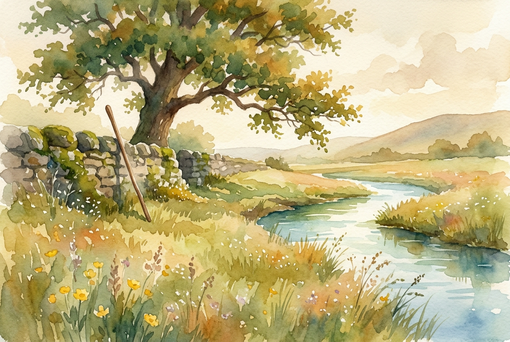

# Leitura Diária: Psalm 23

*8 de agosto de 2026*

> *(Image: A serene, sunlit meadow beside a gently flowing stream, with a simple wooden staff resting against an ancient stone wall under the shade of a large oak tree.)*

## A Leitura (PT-NVI)

**Psalm 23**

> 1 O Senhor é o meu pastor; de nada terei falta. 2 Em verdes pastagens me faz repousar e me conduz a águas tranqüilas; 3 restaura-me o vigor. Guia-me nas veredas da justiça por amor do seu nome. 4 Mesmo quando eu andar por um vale de trevas e morte, não temerei perigo algum, pois tu estás comigo; a tua vara e o teu cajado me protegem. 5 Preparas um banquete para mim à vista dos meus inimigos. Tu me honras, ungindo a minha cabeça com óleo e fazendo transbordar o meu cálice. 6 Sei que a bondade e a fidelidade me acompanharão todos os dias da minha vida, e voltarei à casa do Senhor enquanto eu viver.

## A História

A poesia do antigo Oriente Médio frequentemente retratava reis como pastores, responsáveis pelo bem-estar absoluto de seu povo. Este salmo adota essa imagem da realeza, mas a torna profundamente íntima. O autor imagina uma vida inteiramente sustentada por um cuidador divino que antecipa todas as necessidades físicas e espirituais. O cenário transita de uma paisagem pastoril para um banquete farto oferecido por um anfitrião generoso. Em ambos os ambientes, a realidade central não é a ausência de perigo, mas a presença esmagadora de um protetor. Os vales mais escuros e os adversários mais próximos continuam fazendo parte da jornada, mas perdem o poder de causar pânico.

## Aplicação para Hoje

Passamos grande parte de nossas vidas tentando garantir nossa própria paz, vigiando o horizonte em busca de ameaças e acumulando recursos contra ansiedades futuras. Esta antiga canção oferece uma maneira radicalmente diferente de viver. Ela nos convida a abandonar a autogestão frenética e a confiar que estamos sendo ativamente cuidados. O verdadeiro descanso não exige um ambiente perfeito ou a resolução de todos os nossos problemas. Pelo contrário, ele nasce do reconhecimento de uma presença firme e protetora que caminha ao nosso lado no escuro e prepara uma mesa para nós no meio do caos. Podemos respirar fundo, sabendo que não precisamos pastorear a nós mesmos.

---

*Citações bíblicas extraídas da Nova Versão Internacional (NVI), © 1993, 2000 por Biblica, Inc. Usado com permissão.*
