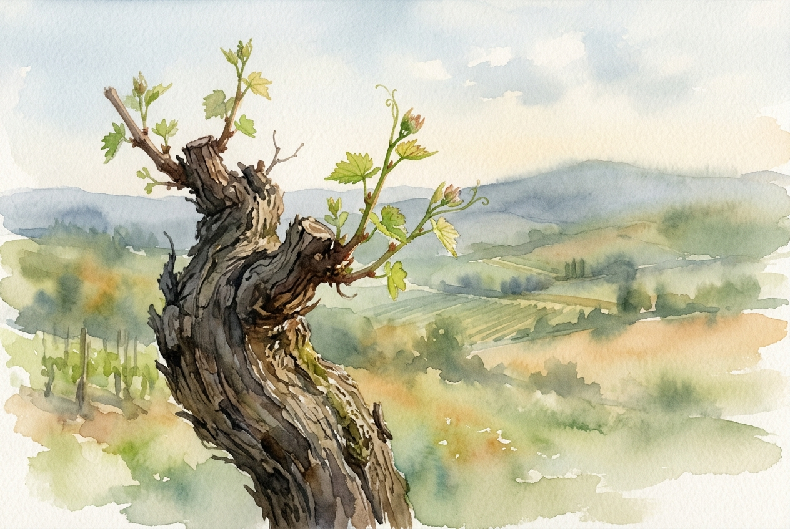

# Daily Reading: John 15:1-11

*September 27, 2026*

> *(Image: A close-up of a weathered grapevine trunk in early spring light, with fresh green shoots emerging from carefully pruned branches, set against a soft, blurred landscape of rolling hills.)*

## The Reading (NLT)

**John 15:1-11**

> 1 I am the true grapevine, and my Father is the gardener. 2 He cuts off every branch of mine that doesn't produce fruit, and he prunes the branches that do bear fruit so they will produce even more. 3 You have already been pruned and purified by the message I have given you. 4 Remain in me, and I will remain in you. For a branch cannot produce fruit if it is severed from the vine, and you cannot be fruitful unless you remain in me. 5 Yes, I am the vine; you are the branches. Those who remain in me, and I in them, will produce much fruit. For apart from me you can do nothing. 6 Anyone who does not remain in me is thrown away like a useless branch and withers. Such branches are gathered into a pile to be burned. 7 But if you remain in me and my words remain in you, you may ask for anything you want, and it will be granted! 8 When you produce much fruit, you are my true disciples. This brings great glory to my Father. 9 I have loved you even as the Father has loved me. Remain in my love. 10 When you obey my commandments, you remain in my love, just as I obey my Father's commandments and remain in his love. 11 I have told you these things so that you will be filled with my joy. Yes, your joy will overflow!

## The Story

In the ancient Mediterranean world, vineyards were everywhere, and the imagery of vines and branches was deeply woven into Israel's cultural and spiritual identity. The Hebrew Scriptures often depicted the nation as a vineyard planted by God, though one that frequently yielded bitter harvests. In his final hours with his friends, Jesus redefines this ancient symbol. He shifts the focus from a collective national identity to an intimate, sustaining connection with himself. The agricultural metaphor relies on the meticulous knowledge of the viticulturist, reminding us that a gardener does not hack away at a vine in anger, but prunes it carefully to direct its energy toward vital growth.

## Application for Today

We often approach our spiritual lives as a series of tasks to accomplish, exhausting ourselves in the effort to be good or useful. Yet the invitation here is not to strive for better results, but simply to stay connected. A branch does not strain to produce grapes; it only has to remain attached to the source of its life. Sometimes, the process of growth involves the painful experience of being pruned, where we lose habits or comforts to make room for a deeper vitality. When we focus on resting in that sustaining love rather than our own output, the natural result is a profound and overflowing joy.

---

*Scripture quotations are taken from the Holy Bible, New Living Translation, copyright © 1996, 2004, 2015 by Tyndale House Foundation. Used by permission of Tyndale House Publishers.*
