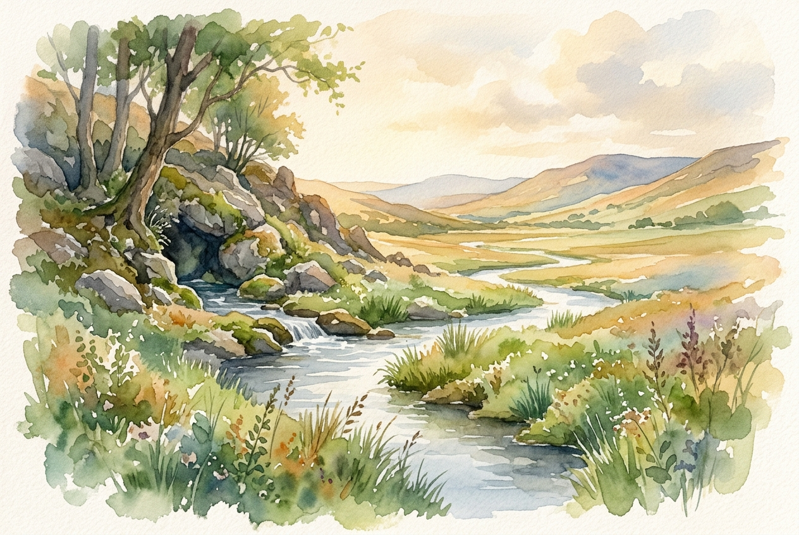

# Daily Reading: 1 John 4:7-16

*September 29, 2026*

> *(Image: A gentle stream flowing from a hidden spring into a wide sunlit valley, watering vibrant green plants along its banks.)*

## The Reading (NLT)

**1 John 4:7-16**

> 7 Dear friends, let us continue to love one another, for love comes from God. Anyone who loves is a child of God and knows God. 8 But anyone who does not love does not know God, for God is love. 9 God showed how much he loved us by sending his one and only Son into the world so that we might have eternal life through him. 10 This is real love not that we loved God, but that he loved us and sent his Son as a sacrifice to take away our sins. 11 Dear friends, since God loved us that much, we surely ought to love each other. 12 No one has ever seen God. But if we love each other, God lives in us, and his love is brought to full expression in us. 13 And God has given us his Spirit as proof that we live in him and he in us. 14 Furthermore, we have seen with our own eyes and now testify that the Father sent his Son to be the Savior of the world. 15 All who declare that Jesus is the Son of God have God living in them, and they live in God. 16 We know how much God loves us, and we have put our trust in his love. God is love, and all who live in love live in God, and God lives in them.

## The Story

The early Christian community receiving this letter was fracturing under the weight of theological disputes and relational conflict. In response, the writer does not offer a list of behavioral rules or debate points. Instead, the focus shifts to the very nature of the divine. The letter insists that affection for others is not a human invention or a social contract, but something that originates entirely outside of us. To know the Creator is to be caught up in the current of this divine reality. The ultimate proof of this reality was already demonstrated in history, stepping into the human experience to bridge the gap between heaven and earth.

## Application for Today

We often treat love as a limited resource that we must somehow generate from our own emotional reserves. When we encounter difficult people or exhausting circumstances, that well quickly runs dry. This passage offers a profound relief: we are not the source of the water, only the channel. When we feel empty, our task is not to try harder to conjure up affection, but to reconnect with the origin of love itself. By receiving what has already been freely given to us, we find the capacity to extend grace outward. As we care for one another in ordinary, practical ways, the invisible divine presence becomes visible in our neighborhoods and homes.

---

*Scripture quotations are taken from the Holy Bible, New Living Translation, copyright © 1996, 2004, 2015 by Tyndale House Foundation. Used by permission of Tyndale House Publishers.*
