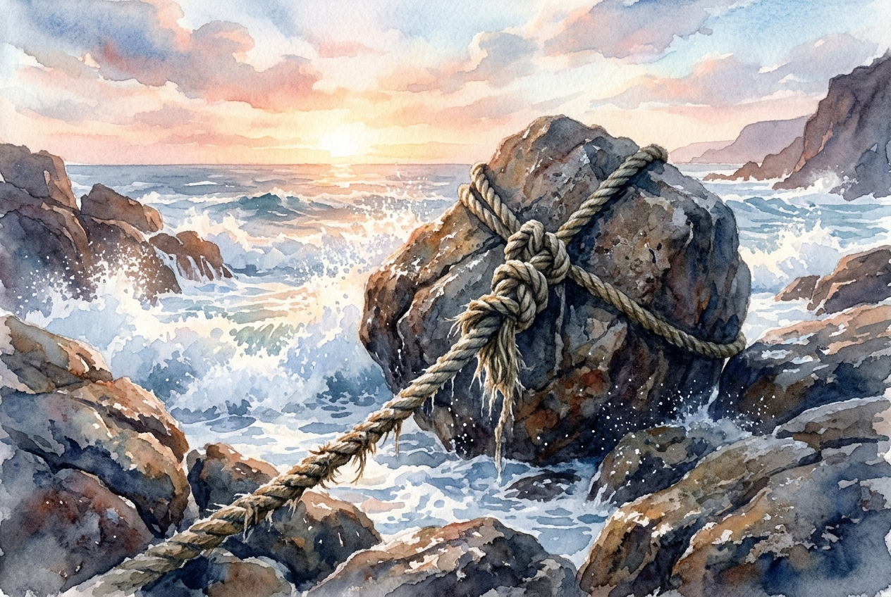

# Leitura Diária: Romans 8:31-39

*30 de setembro de 2026*

> *(Image: A thick weathered nautical rope securely anchored to a massive stone on a rugged coastline, holding firm as ocean waves crash around it under a breaking dawn sky.)*

## A Leitura (PT-NVI)

**Romans 8:31-39**

> 31 Que diremos, pois, diante dessas coisas? Se Deus é por nós, quem será contra nós? 32 Aquele que não poupou a seu próprio Filho, mas o entregou por todos nós, como não nos dará juntamente com ele, e de graça, todas as coisas? 33 Quem fará alguma acusação contra os escolhidos de Deus? É Deus quem os justifica. 34 Quem os condenará? Foi Cristo Jesus que morreu; e mais, que ressuscitou e está à direita de Deus, e também intercede por nós. 35 Quem nos separará do amor de Cristo? Será tribulação, ou angústia, ou perseguição, ou fome, ou nudez, ou perigo, ou espada? 36 Como está escrito: "Por amor de ti enfrentamos a morte todos os dias; somos considerados como ovelhas destinadas ao matadouro". 37 Mas, em todas estas coisas somos mais que vencedores, por meio daquele que nos amou. 38 Pois estou convencido de que nem morte nem vida, nem anjos nem demônios, nem o presente nem o futuro, nem quaisquer poderes, 39 nem altura nem profundidade, nem qualquer outra coisa na criação será capaz de nos separar do amor de Deus que está em Cristo Jesus, nosso Senhor.

## A História

Paulo escreve para uma comunidade em Roma que conhecia profundamente a vulnerabilidade. Eles viviam sob um império que exigia lealdade absoluta e frequentemente usava o medo, o status e a violência para mantê-la. Nesta carta, o apóstolo desconstrói sistematicamente as ameaças que normalmente aterrorizariam um cidadão do primeiro século. Ele elabora um inventário completo das ansiedades humanas, abrangendo desde perigos físicos imediatos até forças espirituais invisíveis. Ao esgotar a lista de possíveis adversários, ele descreve um cosmos onde nada tem autoridade para cortar o afeto divino.

## Aplicação para Hoje

Muitas vezes medimos o amor de Deus pelas nossas circunstâncias atuais, interpretando as dificuldades como um sinal de abandono divino. Quando a vida desmorona por causa de uma doença, ruína financeira ou relacionamentos rompidos, o medo silencioso é de que, de alguma forma, escapamos das mãos do Criador. No entanto, o texto insiste que o amor não é a ausência de sofrimento, mas uma corda indestrutível que nos sustenta durante a dor. A garantia da nossa segurança depende inteiramente do caráter de quem segura a corda, não da nossa força para nos agarrarmos a ela. O que quer que você esteja enfrentando hoje não tem o poder de exilá-lo da graça.

---

*Citações bíblicas extraídas da Nova Versão Internacional (NVI), © 1993, 2000 por Biblica, Inc. Usado com permissão.*
