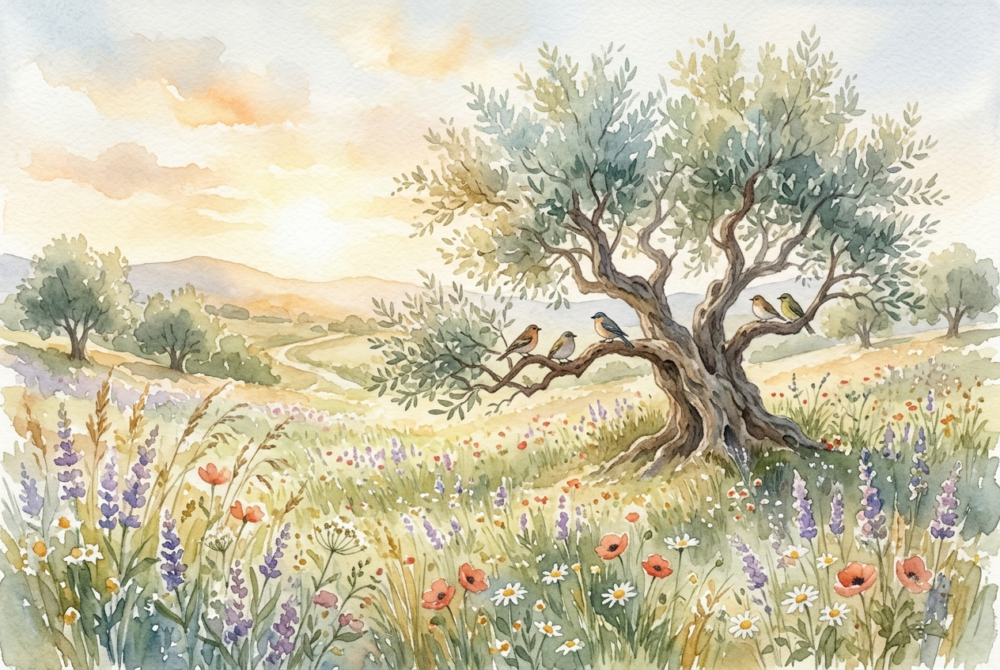

# Leitura Diária: Matthew 6:25-34

*1 de outubro de 2026*

> *(Image: A tranquil sunlit meadow filled with wildflowers swaying gently in the morning breeze, with a few small birds resting on the branches of an old olive tree.)*

## A Leitura (PT-NVI)

**Matthew 6:25-34**

> 25 "Portanto eu lhes digo: não se preocupem com suas próprias vidas, quanto ao que comer ou beber; nem com seus próprios corpos, quanto ao que vestir. Não é a vida mais importante do que a comida, e o corpo mais importante do que a roupa? 26 Observem as aves do céu: não semeiam nem colhem nem armazenam em celeiros; contudo, o Pai celestial as alimenta. Não têm vocês muito mais valor do que elas? 27 Quem de vocês, por mais que se preocupe, pode acrescentar uma hora que seja à sua vida? 28 "Por que vocês se preocupam com roupas? Vejam como crescem os lírios do campo. Eles não trabalham nem tecem. 29 Contudo, eu lhes digo que nem Salomão, em todo o seu esplendor, vestiu-se como um deles. 30 Se Deus veste assim a erva do campo, que hoje existe e amanhã é lançada ao fogo, não vestirá muito mais a vocês, homens de pequena fé? 31 Portanto, não se preocupem, dizendo: ‘Que vamos comer? ’ ou ‘que vamos beber? ’ ou ‘que vamos vestir? ’ 32 Pois os pagãos é que correm atrás dessas coisas; mas o Pai celestial sabe que vocês precisam delas. 33 Busquem, pois, em primeiro lugar o Reino de Deus e a sua justiça, e todas essas coisas lhes serão acrescentadas. 34 Portanto, não se preocupem com o amanhã, pois o amanhã se preocupará consigo mesmo. Basta a cada dia o seu próprio mal".

## A História

Na antiga economia da Galileia, a sobrevivência diária era uma realidade dura para as multidões que ouviam os ensinamentos nas colinas. A agricultura de subsistência e o trabalho braçal significavam que uma colheita ruim ameaçava imediatamente a mesa de qualquer família. Ao apontar para o mundo natural, o mestre fala com pessoas intimamente familiarizadas com a escassez e com o ciclo exaustivo de tentar garantir o próprio futuro. Ele desvia a atenção dos celeiros e aponta para a natureza selvagem ao redor. Ao destacar a existência simples da flora e fauna locais, ele apresenta uma alternativa radical à ansiedade que definia aquela época. O convite é para reconhecer uma presença que sustenta a vida totalmente à parte do esforço humano.

## Aplicação para Hoje

Ainda carregamos o fardo pesado de tentar antecipar e resolver o futuro, mesmo que nossos celeiros sejam diferentes hoje. A ansiedade costuma nos enganar, fazendo parecer que pensar obsessivamente em nossos problemas nos dará algum controle sobre eles. No entanto, projetar a mente para o amanhã apenas esgota a força necessária para os desafios reais que estão bem na nossa frente. Confiar no cuidado divino não significa abandonar nossas responsabilidades, mas sim soltar o controle sobre resultados que não podemos ditar. Somos convidados a ancorar nossa atenção no dia de hoje, lidando apenas com o que temos em mãos. Ao buscar essa orientação de reino agora, descobrimos que temos exatamente o necessário para o presente.

---

*Citações bíblicas extraídas da Nova Versão Internacional (NVI), © 1993, 2000 por Biblica, Inc. Usado com permissão.*
