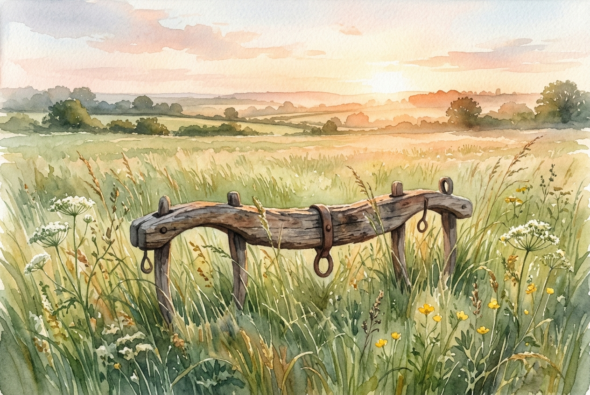

# Leitura Diária: Matthew 11:28-30

*1 de outubro de 2026*

> *(Image: A weathered wooden farm yoke resting peacefully in a field of tall green grass illuminated by the soft warm light of early morning.)*

## A Leitura (PT-NVI)

**Matthew 11:28-30**

> 28 "Venham a mim, todos os que estão cansados e sobrecarregados, e eu lhes darei descanso. 29 Tomem sobre vocês o meu jugo e aprendam de mim, pois sou manso e humilde de coração, e vocês encontrarão descanso para as suas almas. 30 Pois o meu jugo é suave e o meu fardo é leve".

## A História

No mundo agrário do primeiro século, a viga de madeira usada para atrelar animais de tração era uma ferramenta comum do dia a dia. Os líderes religiosos da época frequentemente usavam essa imagem de forma metafórica para descrever as exigências rigorosas e pesadas da estrita observância legal. Para as pessoas comuns, a vida já era um ciclo exaustivo de trabalho físico, impostos e pura sobrevivência. Adicionar uma camada complexa de exigências espirituais fazia com que a rotina parecesse ainda mais esmagadora. Cristo entra nessa exaustão cultural generalizada com uma abordagem totalmente diferente para as obrigações. Ele aponta para um modo de viver que não elimina o trabalho, mas muda completamente o seu peso.

## Aplicação para Hoje

Ainda hoje carregamos pesos esmagadores, mesmo que nossos fardos tenham outra aparência. Colocamos em nossos ombros as exigências do perfeccionismo, a pressão para garantir nosso próprio futuro e a exaustão de tentar administrar tudo sozinhos. O convite estendido nesta passagem não é para abandonar todas as nossas responsabilidades, mas para mudar a forma como as carregamos. Ao nos alinharmos com um mestre que lidera com profunda compassividade, a natureza do nosso esforço diário se transforma. Não estamos mais puxando a carroça apenas com nossa própria força frenética. O verdadeiro descanso não é encontrado na ausência de esforço, mas na presença de um guia que divide a carga e estabelece um ritmo sustentável.

---

*Citações bíblicas extraídas da Nova Versão Internacional (NVI), © 1993, 2000 por Biblica, Inc. Usado com permissão.*
