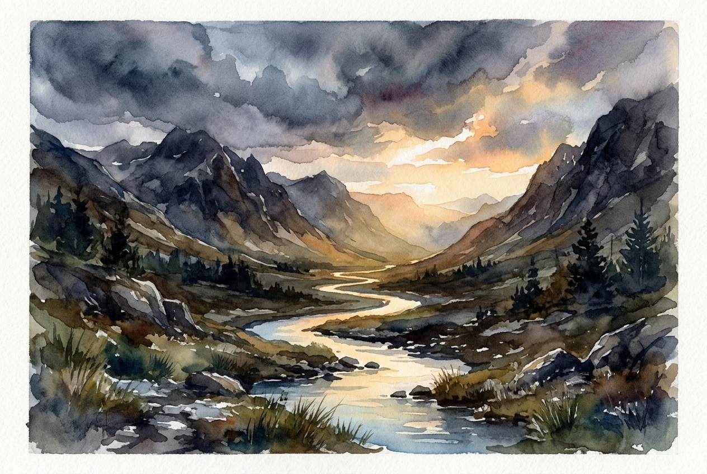

# Daily Reading: Psalm 46

*October 2, 2026*

> *(Image: A gentle, glowing stream flowing peacefully through a rugged, storm-swept mountain valley as warm morning light breaks through heavy dark clouds.)*

## The Reading (NLT)

**Psalm 46**

> 1 God is our refuge and strength, always ready to help in times of trouble. 2 So we will not fear when earthquakes come and the mountains crumble into the sea. 3 Let the oceans roar and foam. Let the mountains tremble as the waters surge! Interlude 4 A river brings joy to the city of our God, the sacred home of the Most High. 5 God dwells in that city; it cannot be destroyed. From the very break of day, God will protect it. 6 The nations are in chaos, and their kingdoms crumble! God's voice thunders, and the earth melts! 7 The Lord of Heaven's Armies is here among us; the God of Israel is our fortress. Interlude 8 Come, see the glorious works of the Lord: See how he brings destruction upon the world. 9 He causes wars to end throughout the earth. He breaks the bow and snaps the spear; he burns the shields with fire. 10 Be still, and know that I am God! I will be honored by every nation. I will be honored throughout the world. 11 The Lord of Heaven's Armies is here among us; the God of Israel is our fortress. Interlude

## The Story

This psalm was likely written during a time of intense national crisis, perhaps a military siege or a natural disaster, when the very foundations of the ancient world seemed to be giving way. The writers used the imagery of roaring oceans and crumbling mountains to represent ultimate, terrifying chaos. In ancient Near Eastern thought, the sea was the supreme symbol of untamed disorder. Yet, right in the middle of this cosmic upheaval, the writer introduces a contrasting scene of a gentle, life-giving river flowing through a secure city. This is not a picture of a fortress completely shielded from the noise, but of a community sustained by a divine presence right in the midst of the turbulence. The text moves from the terror of nature to the tumult of warring nations, illustrating that no human or natural force can outlast the voice of the Creator.

## Application for Today

We all experience seasons where the ground beneath our feet feels unstable and the noise of the world becomes deafening. Personal crises, global uncertainties, and daily anxieties can easily make us feel as though the mountains are falling around us. The invitation here is not to pretend the storm is an illusion, but to locate the quiet center where the divine presence dwells. True security comes from recognizing that we do not have to fight every battle or manage every possible outcome. Letting go of our need to control everything allows us to experience the profound peace of simply knowing who holds the world together. When we stop our frantic striving, we make room to notice the gentle current of grace that is already sustaining us.

---

*Scripture quotations are taken from the Holy Bible, New Living Translation, copyright © 1996, 2004, 2015 by Tyndale House Foundation. Used by permission of Tyndale House Publishers.*
