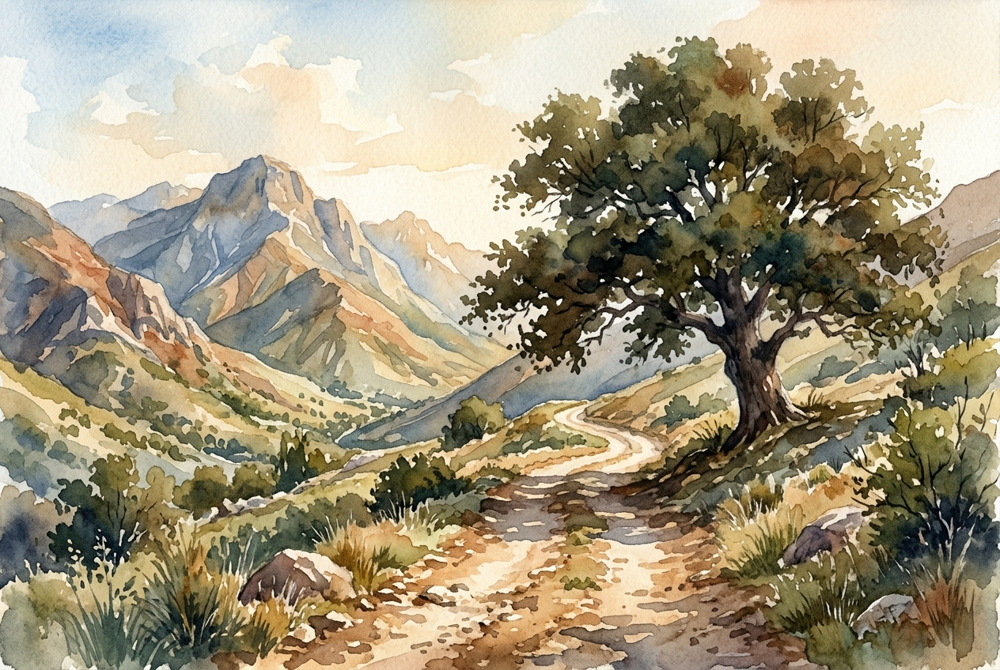

# Daily Reading: Psalm 121

*October 3, 2026*

> *(Image: A sunlit dirt path winding through rugged, towering mountains, with a single large tree casting a deep, protective shadow over the trail.)*

## The Reading (NLT)

**Psalm 121**

> 1 I look up to the mountainsdoes my help come from there? 2 My help comes from the Lord, who made heaven and earth! 3 He will not let you stumble; the one who watches over you will not slumber. 4 Indeed, he who watches over Israel never slumbers or sleeps. 5 The Lord himself watches over you! The Lord stands beside you as your protective shade. 6 The sun will not harm you by day, nor the moon at night. 7 The Lord keeps you from all harm and watches over your life. 8 The Lord keeps watch over you as you come and go, both now and forever.

## The Story

This ancient song was likely sung by pilgrims traveling the long, dangerous roads up to Jerusalem. The geography of the ancient Near East was rugged, and the hills were notorious hiding places for bandits and wild animals. When travelers looked up at the mountains, they did not see a serene landscape, but a source of deep anxiety and potential threat. The singer shifts their gaze past the dangerous peaks to the Creator of those very heights. The poem emphasizes a vigilant protector, one who is not bound by human limitations like fatigue or distraction. The imagery moves from vast cosmic creation to the intimate, personal shade standing right beside the traveler.

## Application for Today

We often face our own mountains, whether they are looming deadlines, health crises, or fractured relationships that threaten to overwhelm us. It is natural to look at these obstacles and feel a sense of dread about the journey ahead. Yet, the same vigilant presence that guarded ancient travelers is actively watching over our steps today. We are invited to shift our focus from the towering threats to the one who crafted the earth beneath our feet. Knowing we have a guardian who never clocks out allows us to travel through our days with a quiet confidence. We can move forward, trusting that our coming and going is held securely.

---

*Scripture quotations are taken from the Holy Bible, New Living Translation, copyright © 1996, 2004, 2015 by Tyndale House Foundation. Used by permission of Tyndale House Publishers.*
