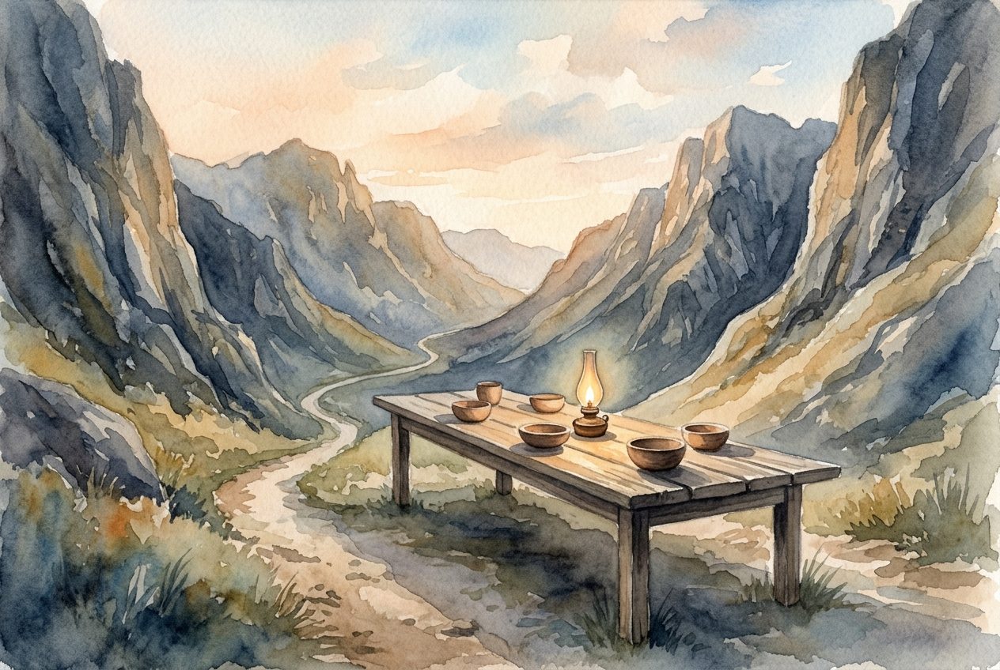

# Leitura Diária: Psalm 23

*3 de outubro de 2026*

> *(Image: A long wooden table set with simple earthen bowls and a glowing oil lamp, placed unexpectedly in the middle of a rugged, shadowed mountain pass.)*

## A Leitura (PT-NVI)

**Psalm 23**

> 1 O Senhor é o meu pastor; de nada terei falta. 2 Em verdes pastagens me faz repousar e me conduz a águas tranqüilas; 3 restaura-me o vigor. Guia-me nas veredas da justiça por amor do seu nome. 4 Mesmo quando eu andar por um vale de trevas e morte, não temerei perigo algum, pois tu estás comigo; a tua vara e o teu cajado me protegem. 5 Preparas um banquete para mim à vista dos meus inimigos. Tu me honras, ungindo a minha cabeça com óleo e fazendo transbordar o meu cálice. 6 Sei que a bondade e a fidelidade me acompanharão todos os dias da minha vida, e voltarei à casa do Senhor enquanto eu viver.

## A História

No antigo Oriente Médio, o trabalho de um pastor era íntimo e perigoso ao mesmo tempo. Os rebanhos precisavam de movimento constante para encontrar pastagens frescas e água, o que muitas vezes os levava por ravinas íngremes e sombrias. Esses vales profundos estavam repletos de ameaças reais, desde predadores escondidos nas rochas até enchentes repentinas. No entanto, a presença do pastor mudava completamente a experiência para o rebanho vulnerável. O poema muda sua imagem de um pasto para um banquete real, refletindo os antigos costumes de hospitalidade. Em uma cultura onde o anfitrião era totalmente responsável pela segurança do hóspede, ser recebido à mesa significava proteção absoluta. A jornada por terrenos perigosos termina em um lugar de acolhimento radical e abundante.

## Aplicação para Hoje

Muitas vezes esperamos que uma vida de fé nos faça desviar dos vales escuros e difíceis. Contudo, este cântico antigo não promete a ausência de perigo, mas sim a garantia absoluta da companhia divina. Quando o terreno da sua vida se torna assustador ou exaustivo, você não está vagando sem rumo ou solitário. O mesmo cuidado que guia você para momentos de descanso também caminha bem ao seu lado em épocas de profunda incerteza. Você está sendo conduzido a um lugar onde é fortemente protegido e profundamente honrado. Mesmo quando cercado por ameaças, é possível encontrar uma paz silenciosa e desafiadora em uma mesa preparada especialmente para você. Descanse na certeza de que a bondade e o amor estão ativamente buscando você hoje.

---

*Citações bíblicas extraídas da Nova Versão Internacional (NVI), © 1993, 2000 por Biblica, Inc. Usado com permissão.*
