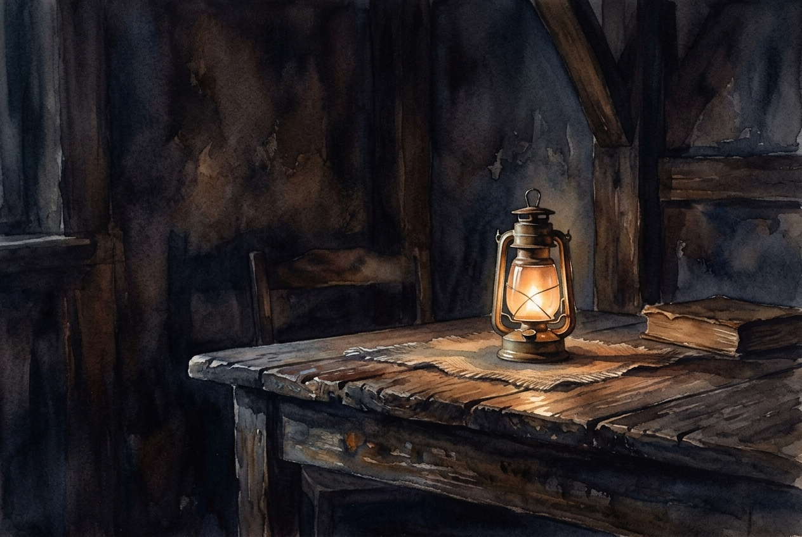

# Leitura Diária: John 3:16-21

*4 de outubro de 2026*

> *(Image: A single warm lantern glowing softly on a weathered wooden table in a dimly lit room, casting gentle light that slowly pushes back the deep shadows.)*

## A Leitura (PT-NVI)

**John 3:16-21**

> 16 "Porque Deus tanto amou o mundo que deu o seu Filho Unigênito, para que todo o que nele crer não pereça, mas tenha a vida eterna. 17 Pois Deus enviou o seu Filho ao mundo, não para condenar o mundo, mas para que este fosse salvo por meio dele. 18 Quem nele crê não é condenado, mas quem não crê já está condenado, por não crer no nome do Filho Unigênito de Deus. 19 Este é o julgamento: a luz veio ao mundo, mas os homens amaram as trevas, e não a luz, porque as suas obras eram más. 20 Quem pratica o mal odeia a luz e não se aproxima da luz, temendo que as suas obras sejam manifestas. 21 Mas quem pratica a verdade vem para a luz, para que se veja claramente que as suas obras são realizadas por intermédio de Deus".

## A História

O autor deste Evangelho descreve a chegada de Jesus não como o bater do martelo de um juiz, mas como uma lanterna sendo levada para um quarto escuro. No mundo antigo, a escuridão oferecia um esconderijo conveniente, enquanto a luz expunha todas as falhas e segredos. O texto aponta para um instinto humano natural de recuar para as sombras quando sentimos vergonha ou precisamos nos defender. No entanto, o propósito divino apresentado aqui inverte a expectativa de uma divindade dura e punitiva. Em vez disso, a grande missão de resgate é motivada inteiramente por um afeto profundo por toda a criação.

## Aplicação para Hoje

Muitas vezes carregamos a suposição de que entrar na presença de Deus resultará em condenação imediata por nossas falhas. É muito mais fácil permanecer escondido, mantendo nossas lutas e erros guardados em segurança no escuro. Mas o convite aqui é perceber que a claridade não tem a intenção de nos interrogar, mas de nos curar. Quando paramos de nos esconder e damos um passo à frente, descobrimos que a exposição que tanto temíamos é, na verdade, o início da liberdade. Somos chamados a abandonar o sigilo e nos permitir ser vistos, confiando plenamente nos motivos daquele que segura a lanterna.

---

*Citações bíblicas extraídas da Nova Versão Internacional (NVI), © 1993, 2000 por Biblica, Inc. Usado com permissão.*
