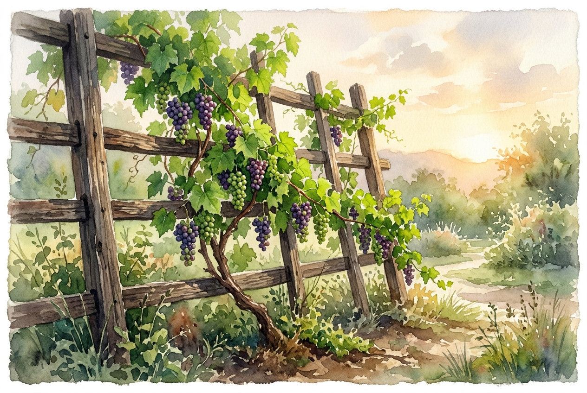

# Daily Reading: Galatians 5:22-26

*October 4, 2026*

> *(Image: A vibrant green vine bearing fresh fruit climbing a rustic wooden trellis bathed in warm morning sunlight.)*

## The Reading (NLT)

**Galatians 5:22-26**

> 22 But the Holy Spirit produces this kind of fruit in our lives: love, joy, peace, patience, kindness, goodness, faithfulness, 23 gentleness, and self-control. There is no law against these things! 24 Those who belong to Christ Jesus have nailed the passions and desires of their sinful nature to his cross and crucified them there. 25 Since we are living by the Spirit, let us follow the Spirit's leading in every part of our lives. 26 Let us not become conceited, or provoke one another, or be jealous of one another.

## The Story

Paul writes to a community struggling to figure out what a transformed life actually looks like. Instead of handing them a rigid checklist of rules, he uses an agricultural metaphor. He describes a natural, organic growth that emerges when a person is rooted in the Divine. The old habits of competition, envy, and self-centered ambition are described as something put to rest permanently. In their place, a new kind of harvest begins to appear. This isn't about forced behavior modification, but rather allowing a deeper presence to direct their steps.

## Application for Today

It is easy to treat spiritual growth like a strenuous self-improvement project where we try to manufacture our own patience or kindness. Yet, a tree does not strain to produce fruit; it simply draws nutrients from the soil and sunlight. When we let go of our need to control others and abandon our hidden resentments, we create space for something beautiful to take root. We are invited to align our daily rhythm with a gentle, guiding presence. As we walk this path, the natural result is a life marked by deep peace and quiet goodness.

---

*Scripture quotations are taken from the Holy Bible, New Living Translation, copyright © 1996, 2004, 2015 by Tyndale House Foundation. Used by permission of Tyndale House Publishers.*
