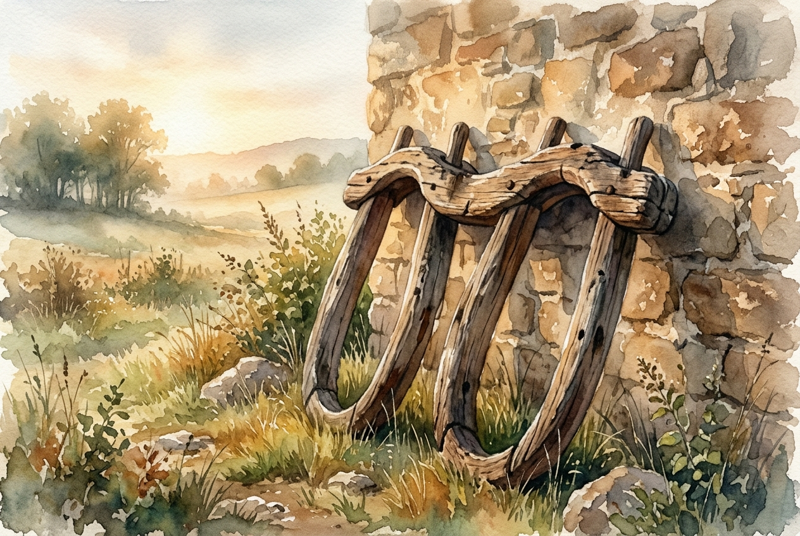

# Leitura Diária: Matthew 11:28-30

*6 de outubro de 2026*

> *(Image: A pair of weathered wooden yokes resting against a stone wall bathed in warm, soft morning light.)*

## A Leitura (PT-NVI)

**Matthew 11:28-30**

> 28 "Venham a mim, todos os que estão cansados e sobrecarregados, e eu lhes darei descanso. 29 Tomem sobre vocês o meu jugo e aprendam de mim, pois sou manso e humilde de coração, e vocês encontrarão descanso para as suas almas. 30 Pois o meu jugo é suave e o meu fardo é leve".

## A História

Nas sociedades agrícolas do primeiro século, o jugo era uma ferramenta comum usada para emparelhar animais na lavoura. Frequentemente, um boi mais velho e experiente era colocado ao lado de um mais jovem para guiar o ritmo e suportar a maior parte do peso. Os mestres religiosos daquela época costumavam impor pesadas e complexas exigências legalistas ao povo, criando um sistema exaustivo de regras que parecia impossível de cumprir. Jesus contrasta essa estrutura religiosa opressiva com sua própria abordagem sobre a vida e a fé. Ele convida seus ouvintes a dividirem a canga, assumindo o trabalho pesado ao lado deles. Em vez de adicionar mais cobranças, ele oferece um relacionamento definido pela compaixão e pelo esforço compartilhado.

## Aplicação para Hoje

Muitas vezes tratamos a fé como uma lista interminável de conquistas morais ou uma escada que precisamos subir usando apenas nossa própria força. Quando estamos exaustos pelas demandas de nossas carreiras, famílias e até mesmo de nossas expectativas internas, a mensagem aqui é para parar de puxar o arado sozinhos. Adotar o caminho de Jesus não significa que todas as nossas responsabilidades desaparecem de repente. Pelo contrário, significa que não estamos mais suportando o peso esmagador da vida em isolamento. Somos convidados a ajustar nosso ritmo a um guia cuja liderança é marcada por profunda compaixão em vez de expectativas rígidas. O verdadeiro descanso não é encontrado no abandono do nosso trabalho, mas em dividir a carga com alguém que conhece nossos limites e oferece graça.

---

*Citações bíblicas extraídas da Nova Versão Internacional (NVI), © 1993, 2000 por Biblica, Inc. Usado com permissão.*
