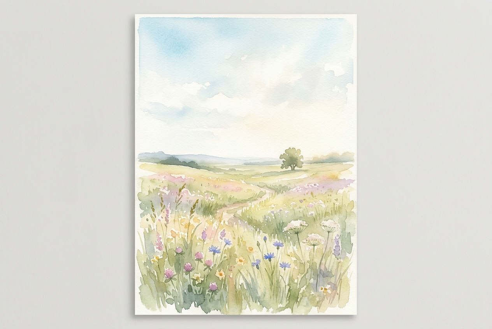

# Daily Reading: Matthew 6:25-34

*October 6, 2026*

> *(Image: A serene, sunlit meadow filled with delicate wildflowers swaying gently under an expansive, clear morning sky.)*

## The Reading (NLT)

**Matthew 6:25-34**

> 25 That is why I tell you not to worry about everyday life whether you have enough food and drink, or enough clothes to wear. Isn't life more than food, and your body more than clothing? 26 Look at the birds. They don't plant or harvest or store food in barns, for your heavenly Father feeds them. And aren't you far more valuable to him than they are? 27 Can all your worries add a single moment to your life? 28 And why worry about your clothing? Look at the lilies of the field and how they grow. They don't work or make their clothing, 29 yet Solomon in all his glory was not dressed as beautifully as they are. 30 And if God cares so wonderfully for wildflowers that are here today and thrown into the fire tomorrow, he will certainly care for you. Why do you have so little faith? 31 So don't worry about these things, saying, ‘What will we eat? What will we drink? What will we wear?' 32 These things dominate the thoughts of unbelievers, but your heavenly Father already knows all your needs. 33 Seek the Kingdom of God above all else, and live righteously, and he will give you everything you need. 34 So don't worry about tomorrow, for tomorrow will bring its own worries. Today's trouble is enough for today.

## The Story

First-century peasant life in Galilee was precarious. Most people lived day-to-day, dependent on unpredictable weather for their crops and daily wages for their food. In this setting, anxiety about basic survival was not just a passing mood but a constant companion. Jesus addresses this deep-seated fear by drawing attention to the natural world surrounding his listeners. He points to the ordinary ecosystem of Galilee, highlighting how the flora and fauna thrive without the frantic accumulation that characterizes human anxiety. His teaching shifts the focus from the scarcity of resources to the abundance of divine care.

## Application for Today

We often live entirely in the future, constructing elaborate contingency plans for scenarios that may never happen. This relentless projection drains our energy for the actual life unfolding in front of us. The call here is to gently detach from the illusion that our worry can control outcomes or secure our existence. Trusting in divine care does not mean ignoring our responsibilities, but rather approaching them without the crushing weight of existential dread. We are invited to practice living within the boundaries of a single day. When we anchor ourselves in the present moment, we discover that grace is always supplied for the challenges right in front of us.

---

*Scripture quotations are taken from the Holy Bible, New Living Translation, copyright © 1996, 2004, 2015 by Tyndale House Foundation. Used by permission of Tyndale House Publishers.*
