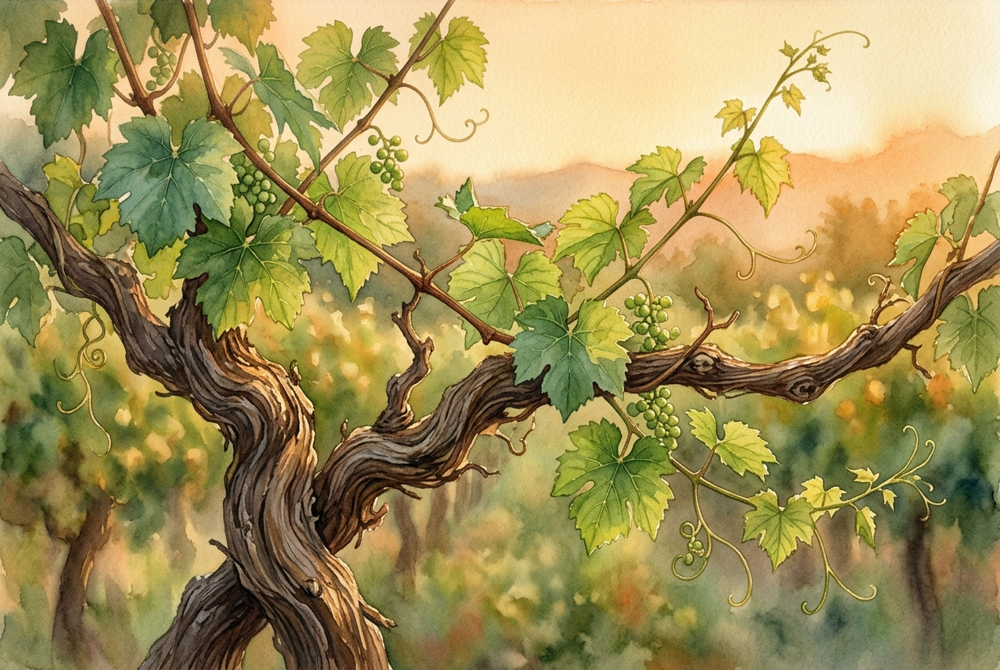

# Leitura Diária: John 15:1-11

*7 de outubro de 2026*

> *(Image: A close-up view of healthy green grape leaves and twisting wooden vines bathed in warm golden hour sunlight, highlighting the intricate connection between the main trunk and its flourishing branches.)*

## A Leitura (PT-NVI)

**John 15:1-11**

> 1 "Eu sou a videira verdadeira, e meu Pai é o agricultor. 2 Todo ramo que, estando em mim, não dá fruto, ele corta; e todo que dá fruto ele poda, para que dê mais fruto ainda. 3 Vocês já estão limpos, pela palavra que lhes tenho falado. 4 Permaneçam em mim, e eu permanecerei em vocês. Nenhum ramo pode dar fruto por si mesmo, se não permanecer na videira. Vocês também não podem dar fruto, se não permanecerem em mim. 5 "Eu sou a videira; vocês são os ramos. Se alguém permanecer em mim e eu nele, esse dá muito fruto; pois sem mim vocês não podem fazer coisa alguma. 6 Se alguém não permanecer em mim, será como o ramo que é jogado fora e seca. Tais ramos são apanhados, lançados ao fogo e queimados. 7 Se vocês permanecerem em mim, e as minhas palavras permanecerem em vocês, pedirão o que quiserem, e lhes será concedido. 8 Meu Pai é glorificado pelo fato de vocês darem muito fruto; e assim serão meus discípulos. 9 "Como o Pai me amou, assim eu os amei; permaneçam no meu amor. 10 Se vocês obedecerem aos meus mandamentos, permanecerão no meu amor, assim como tenho obedecido aos mandamentos de meu Pai e em seu amor permaneço. 11 Tenho lhes dito estas palavras para que a minha alegria esteja em vocês e a alegria de vocês seja completa.

## A História

No antigo mundo agrário, os vinhedos eram uma visão familiar que exigia atenção constante e cuidadosa. As videiras precisam de manutenção intensiva para prosperar, pois os ramos não cuidados crescem desordenadamente e drenam a energia da planta sem produzir nada útil. Um viticultor habilidoso sabe exatamente onde cortar, removendo o que está sem vida e aparando o que é saudável para que possa florescer ainda mais. Essa realidade agrícola serve como uma metáfora poderosa para a vitalidade espiritual. O foco não está na força independente de um único broto, mas em sua conexão vital com a raiz central. A vida flui do núcleo para fora, fazendo com que a única responsabilidade do ramo seja manter-se ligado.

## Aplicação para Hoje

Muitas vezes medimos nosso sucesso espiritual pelo quanto conseguimos realizar por conta própria, tratando a fé como uma lista de tarefas. No entanto, esta passagem desvia nossa atenção da produção frenética para a conexão silenciosa. O processo de poda pode parecer doloroso ou desorientador, à medida que coisas que considerávamos essenciais são removidas. Contudo, essa remoção não é um ato de punição, mas um cultivo cuidadoso feito por quem deseja o nosso bem. A verdadeira vitalidade espiritual vem de descansar em um amor que já nos mantém seguros. Quando paramos de lutar com as próprias forças e focamos em permanecer profundamente enraizados nesse amor, o crescimento acontece naturalmente. O resultado final não é apenas uma vida com propósito, mas uma alegria profunda e transbordante.

---

*Citações bíblicas extraídas da Nova Versão Internacional (NVI), © 1993, 2000 por Biblica, Inc. Usado com permissão.*
