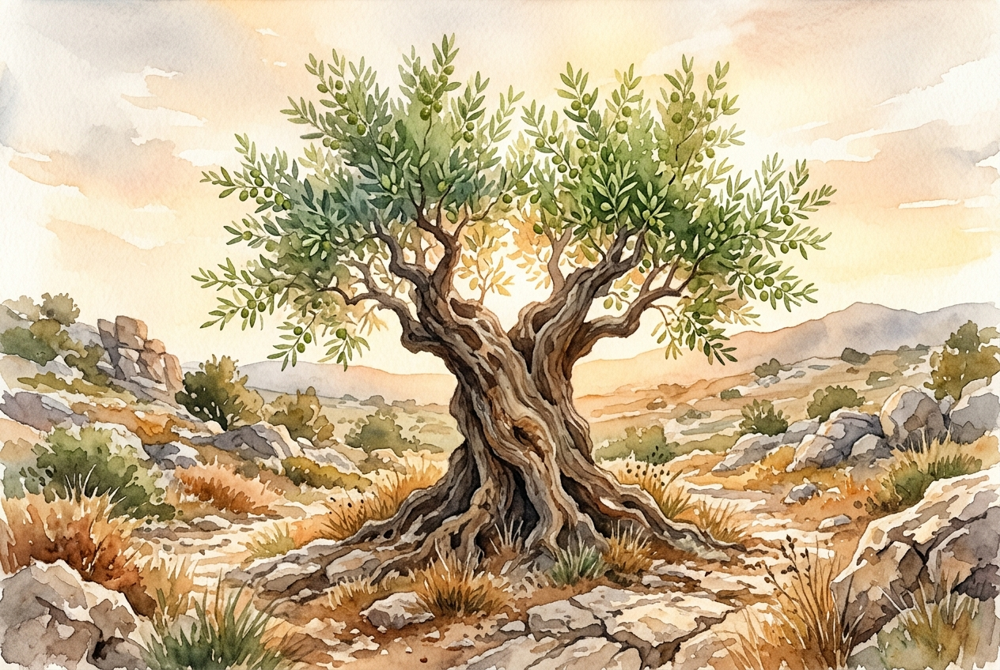

# Daily Reading: 2 Corinthians 4:16-18

*October 7, 2026*

> *(Image: A weathered, ancient olive tree with gnarled bark standing resiliently in a rocky landscape, its deep roots hidden beneath the soil while fresh, vibrant green leaves sprout toward the warm morning light.)*

## The Reading (NLT)

**2 Corinthians 4:16-18**

> 16 That is why we never give up. Though our bodies are dying, our spirits are being renewed every day. 17 For our present troubles are small and won't last very long. Yet they produce for us a glory that vastly outweighs them and will last forever! 18 So we don't look at the troubles we can see now; rather, we fix our gaze on things that cannot be seen. For the things we see now will soon be gone, but the things we cannot see will last forever.

## The Story

In his letters to the early churches, Paul often addressed communities facing intense physical and social pressures. The Greco-Roman world valued outward strength, status, and visible success, making the struggles of the early Christians seem like a sign of defeat. Yet Paul flips this cultural assumption on its head by pointing to a hidden reality. He acknowledges the very real, tangible decay of the physical body and the exhaustion of daily trials. However, he insists that this visible deterioration is not the end of the story. Instead, a profound inner reconstruction is happening simultaneously, completely hidden from the naked eye.

## Application for Today

It is easy to measure our lives by what we can see: our fading health, our shrinking resources, or our visible failures. When the daily grind wears us down, the immediate pain often demands our full attention. But this passage invites us to shift our focus to the quiet, invisible work God is doing within us. The hardships that feel so heavy right now are actually shaping something durable and beautiful in our character. We are invited to trust that our current struggles are not pointless, but are actively participating in our spiritual renewal. By anchoring our hope in what lasts forever, we find the strength to keep going today.

---

*Scripture quotations are taken from the Holy Bible, New Living Translation, copyright © 1996, 2004, 2015 by Tyndale House Foundation. Used by permission of Tyndale House Publishers.*
