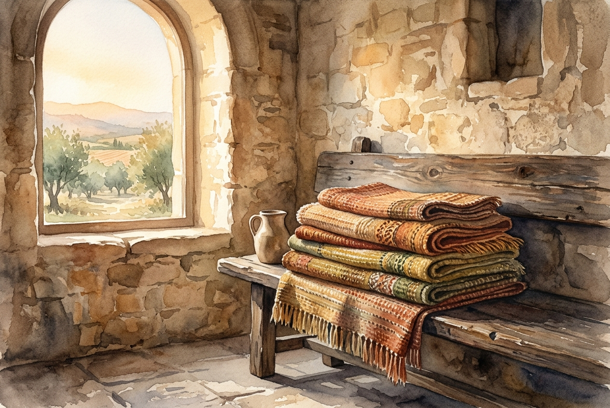

# Leitura Diária: Colossians 3:12-17

*8 de outubro de 2026*

> *(Image: A stack of beautifully woven, textured fabrics in warm earth tones resting on a rustic wooden bench inside a sunlit stone room.)*

## A Leitura (PT-NVI)

**Colossians 3:12-17**

> 12 Portanto, como povo escolhido de Deus, santo e amado, revistam-se de profunda compaixão, bondade, humildade, mansidão e paciência. 13 Suportem-se uns aos outros e perdoem as queixas que tiverem uns contra os outros. Perdoem como o Senhor lhes perdoou. 14 Acima de tudo, porém, revistam-se do amor, que é o elo perfeito. 15 Que a paz de Cristo seja o juiz em seus corações, visto que vocês foram chamados a viver em paz, como membros de um só corpo. E sejam agradecidos. 16 Habite ricamente em vocês a palavra de Cristo; ensinem e aconselhem-se uns aos outros com toda a sabedoria, e cantem salmos, hinos e cânticos espirituais com gratidão a Deus em seus corações. 17 Tudo o que fizerem, seja em palavra ou em ação, façam-no em nome do Senhor Jesus, dando por meio dele graças a Deus Pai.

## A História

Paulo escreve à igreja de Colossos de uma prisão romana, ansioso para ajudá-los a entender como a nova identidade em Cristo deve transformar suas interações cotidianas. Ele usa a forte metáfora do vestuário, encorajando os primeiros cristãos a adotarem virtudes de forma tão consciente quanto vestiriam um casaco de frio. O texto não apresenta uma simples lista de conquistas morais individuais, mas um manual prático de sobrevivência para um grupo diverso de pessoas aprendendo a conviver. Ao apontar o amor como a peça principal que mantém todas as outras em harmonia, o apóstolo enfatiza que a unidade exige um esforço diário e deliberado. Ele imagina uma comunidade local onde a paz atua como o árbitro que resolve as disputas, e onde a gratidão dita o ritmo da vida em comum.

## Aplicação para Hoje

Todas as manhãs acordamos e escolhemos nossas roupas, mas raramente dedicamos a mesma atenção à nossa postura emocional e espiritual. Esta carta nos desafia a abraçar intencionalmente a humildade e a paciência antes de sairmos de casa para enfrentar o mundo. Quando o atrito surge em nossos relacionamentos, somos convidados a deixar que a paz seja o fator decisivo, em vez da nossa necessidade de ter razão. O perdão é apresentado não como um sentimento passageiro, mas como uma escolha ativa, moldada pela graça que nós mesmos já recebemos. Ao lidarmos com nossas responsabilidades diárias, permitir que a gratidão oriente nossas palavras transforma tarefas comuns em atos silenciosos de adoração. O amor continua sendo o fio essencial que mantém unidas as nossas vidas e os nossos laços.

---

*Citações bíblicas extraídas da Nova Versão Internacional (NVI), © 1993, 2000 por Biblica, Inc. Usado com permissão.*
