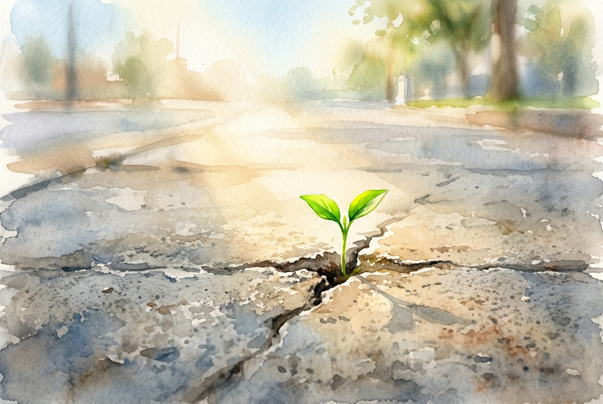

# Leitura Diária: Romans 12:1-2

*9 de outubro de 2026*

> *(Image: A single vibrant green seedling pushes through a crack in a heavy concrete pavement, illuminated by a warm ray of morning sunlight.)*

## A Leitura (PT-NVI)

**Romans 12:1-2**

> 1 Portanto, irmãos, rogo-lhes pelas misericórdias de Deus que se ofereçam em sacrifício vivo, santo e agradável a Deus; este é o culto racional de vocês. 2 Não se amoldem ao padrão deste mundo, mas transformem-se pela renovação da sua mente, para que sejam capazes de experimentar e comprovar a boa, agradável e perfeita vontade de Deus.

## A História

Paulo escreveu esta carta para uma comunidade que vivia no centro do Império Romano, uma sociedade obcecada por poder, status e aparências. Naquele ambiente, a pressão social para se adequar aos valores do império era esmagadora. Os sacrifícios de animais eram uma visão diária nos templos da capital, funcionando como transações para acalmar deuses irados. Paulo subverte completamente essa imagem tão familiar. Em vez de oferecer algo morto em um altar, ele convida os primeiros cristãos a fazerem de suas próprias vidas um ato contínuo e vivo de devoção. O verdadeiro culto, ele argumenta, não se resume a rituais, mas a uma mudança profunda na maneira como vivemos e pensamos.

## Aplicação para Hoje

Somos constantemente moldados pela cultura ao nosso redor, muitas vezes sem sequer percebermos. O mundo exerce uma pressão silenciosa e implacável para que aceitemos seus ritmos de ansiedade, consumo e competição. Resistir a essa força não significa fugir da sociedade, mas permitir que nossas motivações mais profundas sejam totalmente reconfiguradas. Quando entregamos nossos hábitos e pensamentos a Deus, começamos a enxergar além das promessas vazias que nos cercam. Nossa mente ganha a clareza necessária para reconhecer o que realmente traz vida e paz. Nessa clareza, encontramos uma base firme que as pressões do mundo não conseguem abalar.

---

*Citações bíblicas extraídas da Nova Versão Internacional (NVI), © 1993, 2000 por Biblica, Inc. Usado com permissão.*
