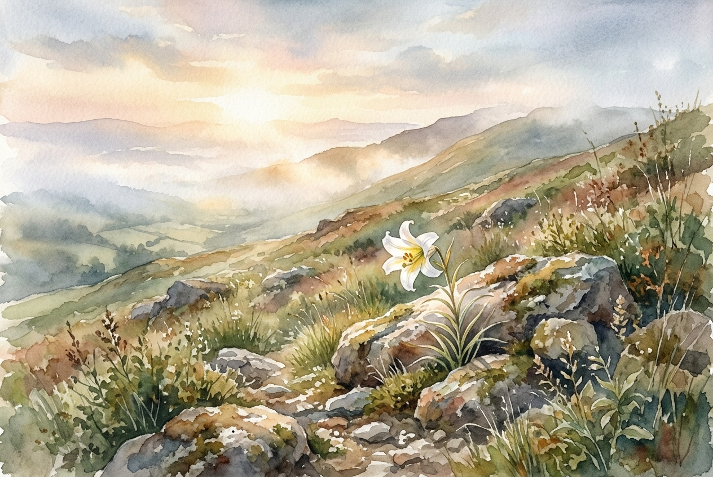

# Daily Reading: Matthew 5:1-12

*October 10, 2026*

> *(Image: A serene hillside at dawn with gentle morning light breaking through the mist, illuminating a single wild lily blooming among rough stones.)*

## The Reading (NLT)

**Matthew 5:1-12**

> 1 One day as he saw the crowds gathering, Jesus went up on the mountainside and sat down. His disciples gathered around him, 2 and he began to teach them. 3 God blesses those who are poor and realize their need for him, for the Kingdom of Heaven is theirs. 4 God blesses those who mourn, for they will be comforted. 5 God blesses those who are humble, for they will inherit the whole earth. 6 God blesses those who hunger and thirst for justice, for they will be satisfied. 7 God blesses those who are merciful, for they will be shown mercy. 8 God blesses those whose hearts are pure, for they will see God. 9 God blesses those who work for peace, for they will be called the children of God. 10 God blesses those who are persecuted for doing right, for the Kingdom of Heaven is theirs. 11 God blesses you when people mock you and persecute you and lie about you and say all sorts of evil things against you because you are my followers. 12 Be happy about it! Be very glad! For a great reward awaits you in heaven. And remember, the ancient prophets were persecuted in the same way.

## The Story

In the ancient world, blessings were typically associated with wealth, military power, and social dominance. When Jesus climbs the hillside and sits down to teach in the traditional posture of a rabbi, his audience likely expects a conventional vision of earthly victory. Instead, he outlines a radical new social order that completely overturns these expectations. He identifies the most vulnerable, the grieving, and the gentle as the primary citizens of his new community. Those who actively pursue peace, show mercy, and suffer for doing what is right are elevated to places of honor. This opening discourse serves as the foundational manifesto for a way of life that stands in stark contrast to the empires of the day.

## Application for Today

We live in a culture that still equates blessing with visible success, comfort, and influence. It is easy to look at our own moments of grief, insignificance, or deep longing for justice and feel as though we have been forgotten. Yet this teaching invites us to completely redefine what it means to experience a good and meaningful life. God’s presence is most profoundly found not in our triumphs, but in our humility and our willingness to extend compassion to others. When we choose the difficult path of making peace or standing up for what is right despite the cost, we are stepping into the very heart of the divine. We are reminded today that true spiritual wealth looks entirely different than what the world values.

---

*Scripture quotations are taken from the Holy Bible, New Living Translation, copyright © 1996, 2004, 2015 by Tyndale House Foundation. Used by permission of Tyndale House Publishers.*
